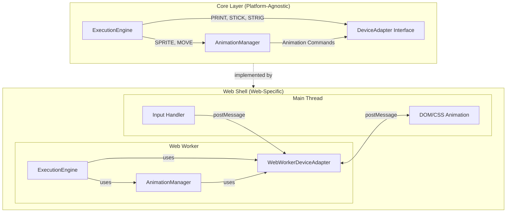

# Family BASIC Screen Device Integration - Architecture Document

## Overview

This document outlines the architectural design for integrating SCREEN device functionality into the Family BASIC interpreter. For detailed screen specifications, see [screen.md](./screen-device-model/screen.md). For animation system details, see [animation.md](./screen-device-model/animation.md).

### Key Architectural Points

1. **Multi-Layer Screen System**: Family BASIC uses 4 main display layers plus BG GRAPHIC screen
   - Background Screen (28×24 characters) - **All PRINT output goes here**
   - Sprite Screen (Front/Back, 256×240 dots)
   - Backdrop Screen (32×30 characters)
   - BG GRAPHIC Screen (28×21 characters)

2. **Core Architecture**: Platform-agnostic core with web-specific shell implementation
   - Core: ExecutionEngine, AnimationManager, DeviceAdapter interface
   - Web Shell: WebWorkerDeviceAdapter, web worker execution, DOM/CSS rendering

3. **Animation System**:
   - AnimationManager runs in web worker (same as ExecutionEngine)
   - Frame rate: ~30 FPS (requestAnimationFrame on main thread)
   - Command-based communication (not pixel data per frame)
   - Device has knowledge of SpriteDefinition and MoveDefinition data
   - Main thread executes animation commands using Konva.js canvas rendering
   - **Position updates happen on main thread** - worker sends initial state, frontend handles frame-by-frame updates

4. **Input Synchronization**: STICK and STRIG are **polled** by the program, not automatically frame-synchronized

## Core Architecture

The architecture is divided into two layers: **Core** (platform-agnostic) and **Web Shell** (web-specific implementation).

### Core Layer

**ExecutionEngine**
- Executes BASIC program statements
- Uses `DeviceAdapter` for: `PRINT`, `STICK(n)`, `STRIG(n)`
- Uses `AnimationManager` for: `SPRITE`, `MOVE`, `MOVE(n)`

**AnimationManager**
- Manages sprite definitions and movement state
- Uses sprite data from `CHARACTER_SPRITES` (from `src/shared/data/sprites.ts`)
- Uses `MoveCharacterCode` enum to identify character types (0-15)
- Calculates movement parameters (start/end positions, duration)
- Uses `DeviceAdapter` to send animation commands (not pixel data)
- Assumes target device has all `SpriteDefinition` and `MoveDefinition` data
- Sends high-level commands: `START_MOVEMENT`, `START_SPRITE_ANIMATION`, `STOP_MOVEMENT`, `ERASE_MOVEMENT`, `MOVEMENT_COMPLETE`

**DeviceAdapter Interface**
- Platform-agnostic interface for device communication
- Handles: Text output (PRINT), Input polling (STICK/STRIG), Animation command execution, Screen state management

### Web Shell Implementation

**WebWorkerDeviceAdapter**
- Implements `DeviceAdapter` interface
- Communicates with DOM via `postMessage` API
- Accepts input from DOM (keystroke events, joystick events)
- Sends commands to DOM: Text output, Sprite display commands, Animation movement commands, Screen state updates

**Execution Environment**
- Both `ExecutionEngine` and `AnimationManager` run in **web worker**
- DeviceAdapter sends animation commands to main thread via postMessage

**Main Thread (DOM Layer)**
- Receives animation commands from web worker via postMessage
- Executes commands using CSS/DOM animation APIs
- Queries sprite status and sends responses back to web worker
- Handles user input events and sends to web worker

### Architecture Diagram



### Communication Flow

**BASIC Program → DeviceAdapter → Main Thread:**
- `PRINT` → `deviceAdapter.printOutput()` → `postMessage({type: 'PRINT_OUTPUT'})` → DOM update
- `STICK(n)` / `STRIG(n)` → `deviceAdapter.getStickState()` / `consumeStrigState()` → returns current state

**Animation Commands:**
- `MOVE` → `AnimationManager.startMovement()` → sends `START_MOVEMENT` command → `postMessage({type: 'ANIMATION_COMMAND'})` → Frontend animation loop starts
- Position movement: requestAnimationFrame loop updates Konva sprite nodes each frame
- Sprite frame animation: Frame index updated each ~8 frames, sprite image re-rendered with new frame
- `CUT`/`ERA` → Frontend syncs actual positions to worker via `UPDATE_ANIMATION_POSITIONS` message
- `MOVE(n)` → `AnimationManager.getMovementStatus()` → returns -1 (moving) or 0 (complete)
- `XPOS(n)`/`YPOS(n)` → `AnimationManager.getSpritePosition()` → returns stored position (synced from frontend on CUT/ERA)

### Core Interfaces

**MoveDefinition Type:**
```typescript
// Represents DEF MOVE(n)=SPRITE(A,B,C,D,E,F) parameters
interface MoveDefinition {
  actionNumber: number      // n: 0-7
  characterType: MoveCharacterCode  // A: 0-15 (from src/shared/data/characters/types.ts)
  direction: number         // B: 0-8 (0=none, 1=up, 2=up-right, 3=right, etc.)
  speed: number             // C: 0-255 (0=slowest, 1=fastest)
  distance: number          // D: 1-255 (total distance = 2×D dots, 0=not displayed)
  priority: number          // E: 0-1 (0=front, 1=behind background)
  colorCombination: number  // F: 0-3
}
```

**AnimationManager Interface:**
```typescript
interface AnimationManager {
  activeMovements: Map<number, MovementState>
  
  startMovement(actionNumber: number, definition: MoveDefinition, startX?: number, startY?: number): void
  stopMovement(actionNumbers: number[]): void
  eraseMovement(actionNumbers: number[]): void
  
  getMovementStatus(actionNumber: number): -1 | 0
  getSpritePosition(actionNumber: number): { x: number; y: number } | null
}
```

**DeviceAdapter Extension:**
```typescript
interface DeviceAdapter {
  // Existing methods
  printOutput(output: string): void
  getStickState(joystickId: number): number
  consumeStrigState(joystickId: number): number
  
  // Screen operations
  getScreenDevice(): ScreenDevice | null
  locate(x: number, y: number): void
  setColor(x: number, y: number, colorPattern: number): void
  cls(): void
  setCgen(allocation: number): void
  setCgset(bgPalette?: number, spritePalette?: number): void
  setPalet(target: 'B' | 'S', combination: number, colors: [number, number, number, number]): void
  
  // Animation command methods
  sendAnimationCommand(command: AnimationCommand): void
  queryAnimationStatus(actionNumber: number): Promise<-1 | 0>
}
```

**Animation Command Types:**
```typescript
type AnimationCommand =
  | { type: 'START_MOVEMENT'; actionNumber: number; startX: number; startY: number; endX: number; endY: number; duration: number }
  | { type: 'START_SPRITE_ANIMATION'; actionNumber: number; spriteSheet: string; frameCount: number; animationDuration: number; invertX: boolean; invertY: boolean }
  | { type: 'STOP_MOVEMENT'; actionNumbers: number[] }
  | { type: 'ERASE_MOVEMENT'; actionNumbers: number[] }
  | { type: 'MOVEMENT_COMPLETE'; actionNumber: number }
  | { type: 'QUERY_MOVEMENT_STATUS'; actionNumber: number; requestId: string }

interface MovementState {
  actionNumber: number
  characterType: MoveCharacterCode  // From src/shared/data/characters/types.ts
  direction: number  // 0-8 (0=none, 1=up, 2=up-right, 3=right, etc.)
  speed: number        // C parameter (0-255)
  remainingDistance: number  // D parameter (total distance = 2×D dots)
  currentX: number
  currentY: number
  startFrame: number
}
```

**ScreenDevice Interface:**
```typescript
interface ScreenDevice {
  // Cursor management
  getCursorPosition(): { x: number; y: number }
  setCursorPosition(x: number, y: number): void
  writeCharacter(x: number, y: number, char: string): void
  
  // Screen clearing
  clearScreen(): void
  
  // Color management
  setColorPattern(x: number, y: number, colorPattern: number): void
  getColorPattern(x: number, y: number): number
  setCgenAllocation(allocation: number): void
  getCgenAllocation(): number
  setColorPalette(bgPalette: number, spritePalette: number): void
  getColorPalette(): { bgPalette: number; spritePalette: number }
  setPaletColors(target: 'B' | 'S', combination: number, colors: ColorCombination): void
  getPaletColors(target: 'B' | 'S', combination: number): ColorCombination
  
  // Type references:
  // ColorCombination = [ColorCode, ColorCode, ColorCode, ColorCode] from src/shared/data/palette.ts
  // ColorCode = number (0-60, hex 0x00-0x3C)
  
  // Screen state
  getScreenBuffer(): ScreenCell[][]
  reset(): void
}
```

## Input Synchronization

STICK and STRIG inputs are **polled** by the BASIC program, not automatically synchronized with animation frames.

**Key Characteristics:**
- Program must explicitly poll inputs in a loop
- Input values reflect current state at time of polling
- State persists until changed or program checks it
- No automatic frame synchronization required

**Implementation:**
- DeviceAdapter maintains input state
- Events update state, but program still polls via function calls
- STICK values persist until changed
- STRIG values may auto-reset after being read (implementation-dependent)

## Design Guidelines

### Screen Operations

**PRINT Integration:**
- `PrintExecutor` must use `ScreenDevice.writeCharacter()` to write to screen buffer
- Respect cursor position set by `LOCATE`
- Handle column wrapping (28) and line scrolling (24)
- Tab stops calculated relative to current cursor X position

**Screen Command Executors:**
- `LocateExecutor`: Parse `LOCATE X, Y`, validate ranges, call `deviceAdapter.locate()`
- `ColorExecutor`: Parse `COLOR X, Y, n`, validate, call `deviceAdapter.setColor()`
- `ClsExecutor`: Call `deviceAdapter.cls()`
- `CgenExecutor`, `CgsetExecutor`, `PaletExecutor`: Parse and validate parameters, call respective deviceAdapter methods

### Animation Implementation

**AnimationManager (in Web Worker):**
- Calculates movement parameters: start position, end position, duration
- Looks up character animation config to determine sprite sequence
- Sends `START_MOVEMENT` command with position and duration
- Sends `START_SPRITE_ANIMATION` command with sprite sheet URL and animation parameters
- Tracks movement state internally for `MOVE(n)` queries

**Konva Animation Executor (Main Thread):**
- Receives animation commands via postMessage
- For `START_MOVEMENT`: Creates/updates MovementState with initial position
- Animation loop (requestAnimationFrame) updates positions each frame:
  - Calculates distance per frame based on speed formula (60/C dots per second)
  - Updates currentX/currentY in localMovementStates
  - Updates Konva sprite node positions directly
  - Updates frame index every ~8 frames for sprite animation
- Sprite rendering: Konva.Image nodes updated with current frame from sequence
- Per-frame or direction-level sprite inversions applied
- On CUT/ERA: Syncs actual positions from Konva nodes back to worker
- Tracks animation status for query responses

**Key Design Principles:**
1. Command-based communication (high-level commands, not pixel data)
2. Device has sprite/move definition knowledge
3. Efficient communication (only when state changes)
4. Platform portability (core reusable for other platforms)

### Web Worker Communication

**Message Types:**
- `PRINT_OUTPUT`: Text output from PRINT statements
- `ANIMATION_COMMAND`: Animation commands from AnimationManager
  - `START_MOVEMENT`: Start sprite movement with initial position
  - `STOP_MOVEMENT`: Stop movement (CUT command)
  - `ERASE_MOVEMENT`: Erase sprite (ERA command)
- `UPDATE_ANIMATION_POSITIONS`: Frontend → Worker position sync (on CUT/ERA)
- `SCREEN_UPDATE`: Screen state changes (cursor, color, etc.)
- `INPUT_EVENT`: User input events (STICK/STRIG)
- `QUERY_ANIMATION_STATUS`: Query movement status
- `ANIMATION_STATUS_RESPONSE`: Response with status

## Implementation Phases

### Phase 1: Core Screen Device
- Create `ScreenDevice` interface
- Implement `WebScreenDevice` class
- Add screen state management
- Implement cursor position tracking
- Implement screen buffer (28×24)

### Phase 2: Basic Commands
- Implement `LOCATE` executor
- Implement `CLS` executor
- Integrate with `PrintExecutor` for cursor-aware output
- Add parser support for `LOCATE` and `CLS`

### Phase 3: Color System
- Implement `COLOR` executor
- Implement color pattern area mapping
- Add parser support for `COLOR`

### Phase 4: Advanced Color Management
- Implement `CGEN`, `CGSET`, `PALET` executors
- Add parser support for all color commands
- Implement color palette system

### Phase 5: Animation System
- Implement `AnimationManager` in web worker
- Implement animation command communication
- Implement DOM animation executor on main thread
- Add sprite movement support

### Phase 6: Integration & Testing
- Integrate with web worker communication
- Add screen update messages
- Create UI components for screen rendering
- Write comprehensive tests

## Testing Strategy

**Unit Tests:**
- Screen device state management
- Cursor position validation
- Color pattern area mapping
- AnimationManager frame calculations
- Movement state tracking

**Integration Tests:**
- Screen command execution
- PRINT with cursor positioning
- Animation command flow
- Web worker communication
- Screen state persistence

**Manual Tests:**
- Visual verification of screen rendering
- Animation smoothness and accuracy
- Input polling behavior
- Screen clearing and cursor movement

## Related Documents

- [Screen Specification](./screen.md) - Detailed screen layer architecture and specifications
- [Animation System](./animation.md) - Animation frame system and timing details
- [Canvas Sprite Animation Design](../../archive/device-models/screen/canvas-sprite-animation-design.md) - Historical canvas-based design (superseded by Konva.js implementation)
