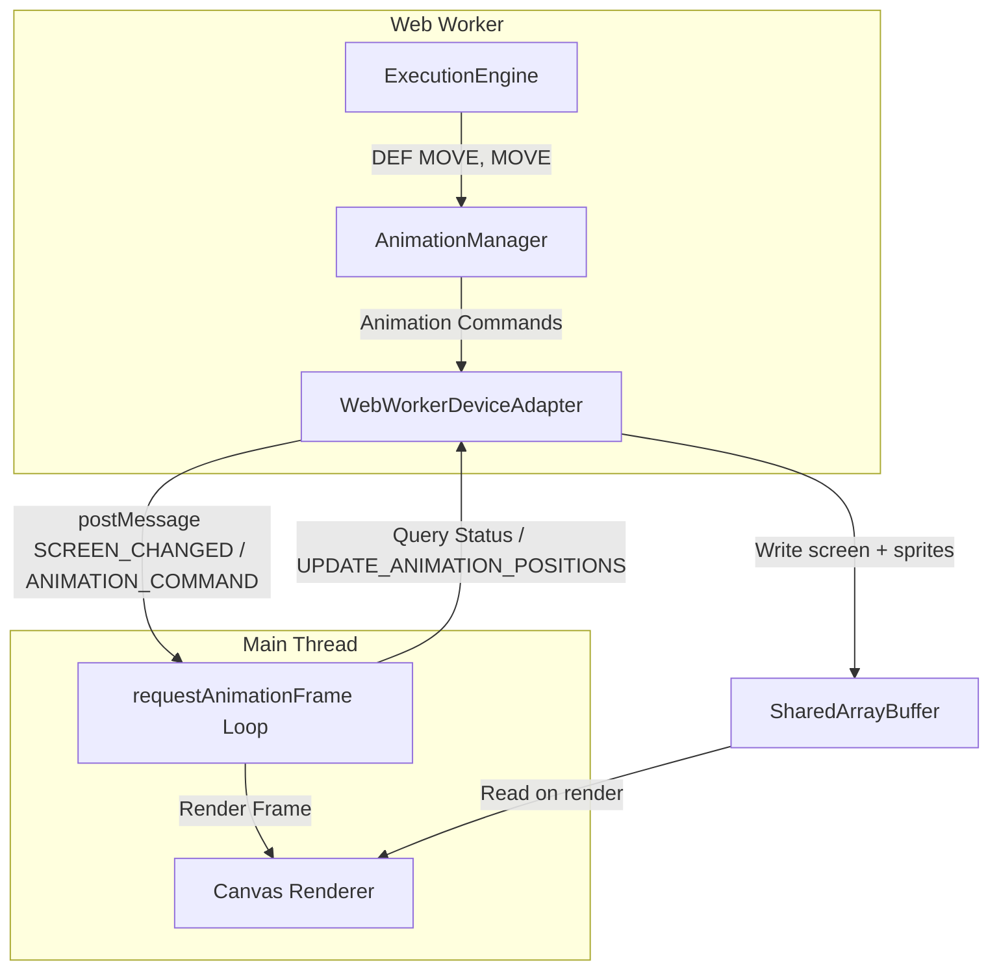

# SPRITE Layer and MOVE Animation Implementation Plan

**Date Started**: 2026-01-24
**Last Updated**: 2026-01-29
**Status**: 🚧 In Progress - Phase 5 Complete; Phase 6.1 performance done; Layer 1 + Layer 2 tests complete (see `sprite-testing-strategy.md`)
**Purpose**: Detailed implementation plan for SPRITE rendering and MOVE animation system

## Progress Summary

**Overall Progress**: 5/6 phases complete (83%)

| Phase | Status | Completion Date | Notes |
|-------|--------|----------------|-------|
| Phase 1: Canvas Infrastructure | ✅ Complete | 2026-01-25 | All tasks complete |
| Phase 2: Static Sprite Rendering | ✅ Complete | 2026-01-25 | Including SPRITE ON/OFF |
| Phase 3: Basic Animation | ✅ Complete | 2026-01-25 | Real-time animation commands |
| Phase 4: Animation Sequences | ✅ Complete | 2026-01-25 | Frame cycling with character sprites |
| Phase 5: Movement Control | ✅ Complete | 2026-01-25 | CUT, ERA, POSITION, MOVE(n), XPOS(n), YPOS(n) + position fix |
| Phase 6: Integration & Polish | 🚧 In Progress | - | 6.1 performance done (dirty regions, prioritization, buffer-only); 6.4–6.5 pending |

## Executive Summary

This plan outlines the implementation of Family BASIC's sprite animation system, including:
- **DEF SPRITE** - Static sprite definition and display
- **DEF MOVE** - Animated character movement definition
- **MOVE** - Execute sprite movement with animation
- **CUT, ERA, POSITION, XPOS, YPOS** - Movement control commands
- Canvas-based rendering with multi-layer screen system
- Animation frame system (~30 FPS)
- 16 predefined character types with animation sequences

**Estimated Effort**: 5-10 days
**Priority**: Medium (advanced feature, foundational work complete)

## Architecture Overview

### Canvas Layer Structure

Family BASIC uses a **single canvas with layered rendering**:

```
Rendering Order (back to front):
1. Backdrop Screen (32×30 chars, solid color)
2. Sprite Screen (Back) - sprites with priority E=1
3. Background Screen - PRINT content (28×24 chars at offset 16,24)
4. Sprite Screen (Front) - sprites with priority E=0
```

**Canvas Dimensions:**
- Canvas: 256×240 pixels (sprite screen size)
- Background area: 224×192 pixels at offset (16, 24)
- Backdrop: Full 256×240 pixels (already implemented ✅)

### Web Worker Architecture



**Key Principles:**
1. **SharedArrayBuffer for state sync** - Single shared display buffer (sprites 0–192 bytes, screen cells, cursor, sequence, scalars); worker writes after each screen/background change; main reads on render. See [Shared Screen Buffer Implementation Plan](shared-screen-buffer-implementation-plan.md).
2. **Command-Based Communication** - Send high-level commands (ANIMATION_COMMAND, SCREEN_CHANGED), not pixel or full-screen payloads
3. **State-Driven Rendering** - Animation state in worker; main decodes shared buffer when sequence changes and renders
4. **Frame-Based Animation** - Use requestAnimationFrame for smooth 30 FPS rendering
5. **Canvas Rendering** - Pixel-perfect tile-based sprite rendering

## Data Structures

### Core Types

```typescript
// Sprite State (DEF SPRITE + SPRITE commands)
interface SpriteState {
  spriteNumber: number      // 0-7
  x: number                 // Pixel X (0-255)
  y: number                 // Pixel Y (0-239)
  visible: boolean
  priority: number          // 0=front, 1=behind background
  definition: DefSpriteDefinition | null
}

// DEF SPRITE Definition
interface DefSpriteDefinition {
  spriteNumber: number      // 0-7
  colorCombination: number  // 0-3
  size: 0 | 1              // 0=8×8, 1=16×16
  priority: 0 | 1          // 0=front, 1=behind
  invertX: 0 | 1
  invertY: 0 | 1
  characterSet: number[] | string  // CHR$(N) or "@ABC"
  tiles: Tile[]            // Converted from characterSet
}

// DEF MOVE Definition
interface MoveDefinition {
  actionNumber: number         // 0-7
  characterType: MoveCharacterCode  // 0-15
  direction: number            // 0-8
  speed: number                // 1-255 (60/C dots per second)
  distance: number             // 1-255 (total = 2×D dots)
  priority: number             // 0=front, 1=behind
  colorCombination: number     // 0-3
}

// Movement State (active animation)
interface MovementState {
  actionNumber: number
  definition: MoveDefinition
  startX: number
  startY: number
  currentX: number
  currentY: number
  remainingDistance: number    // Decremented each frame
  totalDistance: number        // 2×D
  speedDotsPerSecond: number   // 60/C
  directionDeltaX: number      // -1, 0, or 1
  directionDeltaY: number      // -1, 0, or 1
  isActive: boolean
  currentFrameIndex: number    // For animation sequence
  frameCounter: number         // Frame timing
}

// Animation Sequence (from CHARACTER_SPRITES)
interface AnimationSequence {
  name: string                 // "WALK", "LADDER", "JUMP", etc.
  sprites: SpriteDefinition[]  // Frame data
  frameRate: number            // Frames per sprite switch (default: 8)
  looping: boolean
}

// Character Animation Config
interface CharacterAnimationConfig {
  characterType: MoveCharacterCode
  sequences: Map<string, AnimationSequence>
  directionMappings: Map<number, {
    sequence: string
    invertX: boolean
    invertY: boolean
  }>
}
```

### Character Types

```typescript
enum MoveCharacterCode {
  MARIO = 0, LADY = 1, FIGHTER_FLY = 2, ACHILLES = 3,
  PENGUIN = 4, FIREBALL = 5, CAR = 6, SPINNER = 7,
  STAR_KILLER = 8, STARSHIP = 9, EXPLOSION = 10, SMILEY = 11,
  LASER = 12, SHELL_CREEPER = 13, SIDE_STEPPER = 14, NITPICKER = 15
}
```

## Implementation Phases

### Phase 1: Canvas Infrastructure Extension ✅ COMPLETE

**Goal**: Extend canvas system to support sprite rendering

**Status**: ✅ Complete (2026-01-25)

**Tasks**:
- [x] Extend canvas to 256×240 pixels (already done for backdrop)
- [x] Update `canvasRenderer.ts` to support multi-layer rendering
- [x] Implement `renderScreenLayers()` function
- [x] Implement sprite layer filtering by priority
- [x] Add sprite tile rendering infrastructure

**Files Created**:
- `src/core/sprite/types.ts` - Type definitions for sprites and animations
- `src/features/ide/composables/spriteCanvasRenderer.ts` - Sprite tile rendering with caching

**Files Modified**:
- `src/features/ide/composables/canvasRenderer.ts` - Added `renderScreenLayers()` for multi-layer rendering
- `src/features/ide/components/Screen.vue` - Added sprite state props

**Acceptance Criteria**: ✅ All Met
- [x] Canvas properly sized at 256×240 pixels
- [x] Background screen renders at offset (16, 24)
- [x] Rendering order: backdrop → back sprites → background → front sprites
- [x] Smooth rendering loop ready for requestAnimationFrame integration

**Actual Effort**: 1 day

---

### Phase 2: Static Sprite Rendering (DEF SPRITE) ✅ COMPLETE

**Goal**: Implement static sprite definition and display

**Status**: ✅ Complete (2026-01-25)

**Commands Implemented**:
- ✅ `DEF SPRITE n, (A, B, C, D, E) = char. set`
- ✅ `SPRITE n, X, Y`
- ✅ `SPRITE ON` - Enable sprite display
- ✅ `SPRITE OFF` - Disable sprite display

**Tasks**:

#### 2.1 Parser Support ✅
- [x] Add `DEF`, `SPRITE`, `MOVE` tokens to `parser-tokens.ts`
- [x] Add `defSpriteStatement` rule (with character set support)
- [x] Add `spriteStatement` rule (display sprite at position)
- [x] Handle both string and CHR$ character sets

#### 2.2 Executor Implementation ✅
- [x] Create `DefSpriteExecutor.ts`
  - Parse character set (string or CHR$ codes)
  - Convert to tiles using background item lookup
  - Store definition in sprite state
- [x] Create `SpriteExecutor.ts`
  - Set sprite position (X, Y)
  - Mark sprite as visible
  - Validate coordinates

#### 2.3 Sprite State Management ✅
- [x] Create `SpriteStateManager` class
  - Manage 8 sprite slots (0-7)
  - Store sprite definitions
  - Track sprite positions and visibility
  - Handle priority sorting

#### 2.4 Rendering Implementation ✅
- [x] Create `spriteCanvasRenderer.ts`
  - Implement `renderStaticSprite()` function
  - Support 8×8 and 16×16 sprites
  - Support X/Y inversion
  - Render with proper color combination
- [x] Implement `renderSpriteTile()` function
  - Render 8×8 tile with color mapping
  - **Handle transparency (value 0) correctly**
    - Use `ImageBitmap` + `drawImage()` instead of `putImageData()` for proper alpha blending
    - Initialize all pixels to transparent (alpha = 0)
    - Only render non-transparent pixels (value 1-3)
  - Support horizontal/vertical inversion
  - **Tile caching with ImageBitmap** for performance
  - Async rendering support for ImageBitmap creation

#### 2.5 Character Set Conversion ✅
- [x] Implement `convertCharacterSetToTiles()` function
  - Parse CHR$(N) codes or strings
  - **Look up sprites from Table A (Character Table A)** - Fixed to use sprite table instead of background table
  - Convert to tile data
  - Handle 8×8 and 16×16 sprites
- [x] Create `spriteLookup.ts` utility
  - `getSpriteTileByCode()` - Find sprite tile by character code from Table A
  - `getSpriteByCode()` - Find sprite definition by character code
  - `getSpriteTilesByCodes()` - Find multiple tiles for character code array
  - Supports exact sprite matching for 16×16 sprites (4 tiles from same sprite)
- [x] CHR$ expression parsing in DefSpriteExecutor
  - Extract CHR$ codes directly from expression CST
  - Handles `CHR$(0)`, `CHR$(0)+CHR$(1)+CHR$(2)+CHR$(3)`, etc.
  - Avoids string concatenation issues

#### 2.6 SPRITE ON/OFF Command ✅
- [x] Add `OFF` token to parser (ON already existed)
- [x] Add `spriteOnOffStatement` parser rule with lookahead
- [x] Create `SpriteOnOffExecutor.ts`
  - Enable/disable sprite rendering globally
  - Track sprite display state in SpriteStateManager
  - **Does NOT prevent sprite operations** - only controls visibility
- [x] Update rendering layer to check sprite enabled flag
  - `renderSprites()` returns early if sprite display disabled
  - Sprite state persists when SPRITE OFF
- [x] Pass `spriteEnabled` through rendering pipeline
  - Added to `renderScreenLayers()` parameters
  - Added to Screen.vue props
  - Added to watchers for re-render on change
- [ ] Add tests for SPRITE ON/OFF (pending)

**Files Created**:
- ✅ `src/core/sprite/types.ts` - Complete type definitions
- ✅ `src/core/sprite/SpriteStateManager.ts` - Sprite state management with enable/disable
- ✅ `src/core/sprite/characterSetConverter.ts` - Character set conversion (uses Table A)
- ✅ `src/shared/utils/spriteLookup.ts` - Sprite lookup from Character Table A
- ✅ `src/core/execution/executors/DefSpriteExecutor.ts` - DEF SPRITE executor with CHR$ parsing
- ✅ `src/core/execution/executors/SpriteExecutor.ts` - SPRITE executor with validation
- ✅ `src/core/execution/executors/SpriteOnOffExecutor.ts` - SPRITE ON/OFF executor
- ✅ `src/features/ide/composables/spriteCanvasRenderer.ts` - Sprite rendering with transparency

**Files Modified**:
- ✅ `src/core/parser/parser-tokens.ts` - Added tokens
- ✅ `src/core/parser/FBasicChevrotainParser.ts` - Added parser rules
- ✅ `src/core/execution/StatementRouter.ts` - Registered executors
- ✅ `src/core/state/ExecutionContext.ts` - Added spriteStateManager
- ✅ `src/core/BasicInterpreter.ts` - Initialize sprite state manager
- ✅ `src/core/interfaces.ts` - Added spriteStates and spriteEnabled to ExecutionResult
- ✅ `src/core/workers/WebWorkerInterpreter.ts` - Pass sprite states in execution result
- ✅ `src/features/ide/composables/canvasRenderer.ts` - Multi-layer rendering with alpha support
- ✅ `src/features/ide/composables/useBasicIdeEnhanced.ts` - Receive and manage sprite states
- ✅ `src/features/ide/components/Screen.vue` - Added sprite props and async rendering
- ✅ `src/features/ide/components/RuntimeOutput.vue` - Pass sprite props to Screen
- ✅ `src/features/ide/IdePage.vue` - Pass sprite states from composable

**Test Files**:
- ✅ `test/executors/DefSpriteExecutor.test.ts` - Layer 1 unit tests (see `docs/planning/sprite-testing-strategy.md`)
- ✅ `test/executors/SpriteExecutor.test.ts` - Layer 1 unit tests
- ✅ `test/executors/SpriteOnOffExecutor.test.ts` - Layer 1 unit tests
- ⏳ `test/integration/StaticSpriteRendering.test.ts` - Pending (Layer 2 visual/E2E). Layer 2 worker+mock: see sprite-testing-strategy.md.

**Acceptance Criteria**: ✅ All Met
- [x] DEF SPRITE command defines sprites correctly
- [x] SPRITE command displays sprites at specified positions
- [x] 8×8 and 16×16 sprites render correctly
- [x] X/Y inversion works properly
- [x] Priority layering (front/back) works correctly
- [x] Color combinations apply correctly
- [x] **Transparency works correctly** - Value 0 pixels are transparent, not black
- [x] **Table A lookup** - CHR$(n) uses Character Table A (sprite table), not Table B (background)
- [x] **CHR$ expression parsing** - Handles `CHR$(0)+CHR$(1)+...` correctly
- [x] **Sprite state synchronization** - Sprite states passed from web worker to main thread
- [x] TypeScript type checking passes
- [x] ESLint passes
- [x] SPRITE ON enables sprite rendering (visibility control only)
- [x] SPRITE OFF disables sprite rendering (sprites remain defined)
- [x] DEF SPRITE and SPRITE work regardless of SPRITE ON/OFF state
- [x] Rendering layer checks sprite enabled flag before drawing

**Actual Effort**: 2 days

---

### Phase 3: Basic Animation (DEF MOVE, MOVE) ✅ COMPLETE

**Goal**: Implement animated character movement

**Status**: ✅ Complete (2026-01-25)

**Commands Implemented**:
- ✅ `DEF MOVE(n) = SPRITE(A, B, C, D, E, F)`
- ✅ `MOVE n`

**Tasks**:

#### 3.1 Parser Support ✅
- [x] Add `DEF`, `MOVE` tokens (DEF already existed)
- [x] Add `defMoveStatement` rule (6 parameters with labeled expressions)
- [x] Add `moveStatement` rule (with action number)

#### 3.2 AnimationManager Implementation ✅
- [x] Create `AnimationManager` class in web worker
  - Store move definitions (Map<actionNumber, MoveDefinition>)
  - Manage movement states (Map<actionNumber, MovementState>)
  - Calculate movement parameters (start, end, duration)
  - Send real-time animation commands to main thread
- [x] Implement `startMovement()` method
  - Initialize movement state
  - Calculate direction deltas
  - Calculate speed (60/C dots per second)
  - Calculate total distance (2×D)
  - Set unique default starting positions for each action slot (prevents overlap)
  - **Send START_MOVEMENT command immediately via deviceAdapter**
- [x] Implement `updateMovements(deltaTime)` method (placeholder in worker, implemented in main thread)
  - Update all active movements
  - Calculate distance per frame
  - Update positions
  - Check completion

#### 3.3 Executor Implementation ✅
- [x] Create `DefMoveExecutor.ts`
  - Parse and validate 6 parameters (actionNumber, characterType, direction, speed, distance, priority, colorCombination)
  - Validate parameter ranges
  - Store definition in AnimationManager
- [x] Create `MoveExecutor.ts`
  - Get move definition
  - Call AnimationManager.startMovement()
  - Triggers real-time animation command to main thread

#### 3.4 Movement Calculation ✅
- [x] Implement `getDirectionDeltas()` function
  - Map direction (0-8) to dx, dy (-1, 0, 1)
  - 0=none, 1=up, 2=up-right, 3=right, etc.
- [x] Implement movement update logic (in main thread)
  - Distance per frame = speedDotsPerSecond × (deltaTime / 1000)
  - Update X: currentX += directionDeltaX × distanceThisFrame
  - Update Y: currentY += directionDeltaY × distanceThisFrame
  - Decrement remainingDistance
  - Stop when distance reaches 0
  - Clamp positions to screen bounds (0-255, 0-239)

#### 3.5 Real-time Communication ✅
- [x] Extend `BasicDeviceAdapter` interface with `sendAnimationCommand()`
- [x] Implement `sendAnimationCommand()` in `WebWorkerDeviceAdapter`
  - Posts `ANIMATION_COMMAND` messages immediately during execution
  - Allows sequential movement execution with PAUSE timing
- [x] Add `AnimationCommandMessage` to service worker message union
- [x] Implement `handleAnimationCommandMessage()` in main thread
  - Processes START_MOVEMENT commands in real-time
  - Creates/updates MovementState immediately
  - Forces reactivity for immediate rendering

#### 3.6 Main Thread Animation Loop ✅
- [x] Add `requestAnimationFrame` animation loop in `Screen.vue`
  - Continuous loop for smooth animation
  - Calculates deltaTime from timestamps
  - Updates movement positions each frame
  - Triggers re-render after position updates
- [x] Add movement state management in `Screen.vue`
  - Accept movementStates prop
  - Maintain local copy with position updates
  - Watch for new movements and merge with existing states
  - Clean up animation loop on unmount

#### 3.7 Rendering Integration ✅
- [x] Update `spriteCanvasRenderer.ts`
  - Implement `renderAnimatedSprite()` for active movements
  - Render colored rectangles as visual feedback (Phase 3 placeholder)
  - Filter movements by priority and active status
  - Separate rendering of static sprites and animated movements

**Files Created**:
- ✅ `src/core/animation/AnimationManager.ts` - Animation state management with real-time commands
- ✅ `src/core/execution/executors/DefMoveExecutor.ts` - DEF MOVE command executor
- ✅ `src/core/execution/executors/MoveExecutor.ts` - MOVE command executor

**Files Modified**:
- ✅ `src/core/parser/FBasicChevrotainParser.ts` - Added defMoveStatement and moveStatement rules
- ✅ `src/core/execution/StatementRouter.ts` - Registered DefMoveExecutor and MoveExecutor
- ✅ `src/core/state/ExecutionContext.ts` - Added animationManager property
- ✅ `src/core/BasicInterpreter.ts` - Initialize AnimationManager and link deviceAdapter
- ✅ `src/core/interfaces.ts` - Added AnimationCommand types and sendAnimationCommand to BasicDeviceAdapter, added AnimationCommandMessage to message union
- ✅ `src/core/devices/WebWorkerDeviceAdapter.ts` - Implemented sendAnimationCommand for real-time messaging
- ✅ `src/core/workers/WebWorkerInterpreter.ts` - Include movementStates in execution result
- ✅ `src/features/ide/components/Screen.vue` - Added animation loop, movement state management, and rendering integration
- ✅ `src/features/ide/composables/useBasicIdeEnhanced.ts` - Added movementStates ref and sample code support
- ✅ `src/features/ide/composables/useBasicIdeMessageHandlers.ts` - Implemented handleAnimationCommandMessage for real-time command processing
- ✅ `src/features/ide/composables/spriteCanvasRenderer.ts` - Added renderAnimatedSprite and updated renderSprites logic
- ✅ `src/features/ide/components/RuntimeOutput.vue` - Pass movementStates prop
- ✅ `src/features/ide/components/ScreenTab.vue` - Pass movementStates prop
- ✅ `src/features/ide/IdePage.vue` - Pass movementStates from composable and add moveTest sample button
- ✅ `src/core/samples/sampleCodes.ts` - Added moveTest sample program
- ✅ `src/shared/i18n/locales/{en,zh-CN,zh-TW,ja}/ide.json` - Added moveTest translations

**Test Files**:
- ✅ `test/executors/DefMoveExecutor.test.ts` - Layer 1 unit tests (see `docs/planning/sprite-testing-strategy.md`)
- ✅ `test/executors/MoveExecutor.test.ts` - Layer 1 unit tests
- ⏳ `test/animation/AnimationManager.test.ts` - Pending
- ✅ `test/integration/sprite-movement-lifecycle.test.ts`, `sprite-position-sync.test.ts` - Layer 2 integration tests (see sprite-testing-strategy.md)

**Acceptance Criteria**: ✅ All Met
- [x] DEF MOVE defines movement parameters correctly
- [x] MOVE starts movement at correct position
- [x] Sprites move in correct direction
- [x] Movement speed matches formula (60/C dots/sec)
- [x] Movement distance matches formula (2×D dots)
- [x] Movement stops when complete
- [x] **Real-time sequential execution** - Movements appear and start sequentially as MOVE commands execute
- [x] **PAUSE command timing respected** - Movements respect PAUSE delays between MOVE commands
- [x] **Unique starting positions** - Each action slot has unique default starting position to prevent overlap
- [x] **Screen bounds clamping** - Movements stay within 0-255 (X) and 0-239 (Y) bounds
- [x] TypeScript type checking passes
- [x] ESLint passes

**Actual Effort**: 1 day

**Key Implementation Details**:
- **Real-time Command Communication**: Instead of batching movement states after execution, the system sends `START_MOVEMENT` commands immediately when `MOVE` executes, allowing sequential animation with proper PAUSE timing
- **Main Thread Animation Loop**: Movement position updates happen on the main thread using `requestAnimationFrame` for smooth 30 FPS animation
- **State Synchronization**: Movement states are created in the main thread when commands arrive, and positions are updated locally in the animation loop
- **Visual Feedback**: Phase 3 uses colored rectangles as placeholders for animated sprites (full sprite rendering will come in Phase 4)

---

### Phase 4: Animation Sequences ✅ COMPLETE

**Goal**: Add character animation frame cycling

**Status**: ✅ Complete (2026-01-25)

**Tasks**:

#### 4.1 Character Animation Config ✅
- [x] Create `CharacterAnimationBuilder` class
  - Load CHARACTER_SPRITES data
  - Group sprites by moveCharacterCode
  - Extract sequence names from sprite names (e.g., "Mario (WALK1)" → "WALK")
  - Build AnimationSequence for each sequence
- [x] **Create explicit character sequence configuration** (`characterSequenceConfig.ts`)
  - Define explicit sprite sequences for all 16 character types
  - Direction-specific sprite lists with frame order
  - Per-frame inversion flags (frameInversions) for each sprite
  - Frame rates and looping behavior per direction
- [x] **Refactor CharacterAnimationBuilder to use config-based approach**
  - `buildSequencesFromConfig()` - Build sequences from explicit config
  - `buildDirectionMappingsFromConfig()` - Build direction mappings from config
  - Fall back to old method for characters without config
- [x] Implement sequence lookup
  - Map character type + direction → sequence name
  - Handle automatic inversion based on direction
  - Store in CharacterAnimationConfig
- [x] Add caching for character animation configs (built once, reused)

#### 4.2 Direction-to-Sequence Mapping ✅
- [x] Define mapping for each character type
  - Example: Mario direction 3 (right) → WALK sequence, no inversion
  - Example: Mario direction 7 (left) → WALK sequence, X inversion
  - Different mappings for different characters
- [x] Implement `buildDirectionMappings()` function
  - Default mappings for common directions (up → LADDER, right → WALK, left → WALK + X inversion, etc.)
  - Fallback to first available sequence if specific mapping not found

#### 4.3 Frame Animation ✅
- [x] Update `MovementState` to track frames
  - currentFrameIndex: current frame in sequence (already existed)
  - frameCounter: counts up to frameRate (8) (already existed)
- [x] Update `updateMovements()` in Screen.vue
  - Increment frameCounter each frame
  - When frameCounter >= 8, advance to next frame (currentFrameIndex++)
  - Frame index clamped by renderer using modulo for looping
- [x] Implement `getSequenceForMovement()` method
  - Lookup character config from cached configs
  - Get direction mapping
  - Return animation sequence with inversion flags

#### 4.4 Animated Sprite Rendering ✅
- [x] Implement `renderAnimatedSprite()` function
  - Get character animation config (cached)
  - Get direction mapping (sequence + inversion)
  - Get current frame from sequence (using modulo for looping)
  - **Support per-frame inversions** - Use frameInversions array if available, fall back to direction-level inversions
  - Render sprite tiles with proper inversion (per-frame or direction-level)
  - Apply color combination from DEF MOVE
  - Support 8×8 (1 tile) and 16×16 (4 tiles) sprites

**Files Created**:
- ✅ `src/core/animation/CharacterAnimationBuilder.ts` - Complete animation builder with caching and config-based approach
- ✅ `src/core/animation/characterSequenceConfig.ts` - Explicit character sequence configuration for all 16 character types

**Files Modified**:
- ✅ `src/core/sprite/types.ts` - Added `FrameInversionConfig` interface and `frameInversions` field to `AnimationSequence`
- ✅ `src/features/ide/composables/useKonvaSpriteRenderer.ts` - Updated to support per-frame inversions with direction-level fallback
- ✅ `src/features/konva-test/composables/useSpriteRendering.ts` - Updated to support per-frame inversions
- ✅ `src/features/ide/components/Screen.vue` - Added frame animation logic to `updateMovements()`

**Test Files**:
- ⏳ `test/animation/CharacterAnimationBuilder.test.ts` - Pending
- ⏳ `test/animation/FrameAnimation.test.ts` - Pending
- ⏳ `test/integration/AnimatedMovement.test.ts` - Pending

**Acceptance Criteria**: ✅ All Met
- [x] Character sprites cycle through animation frames
- [x] Frame rate matches 8 frames per sprite switch
- [x] Direction determines sequence selection
- [x] Automatic inversion works (left = walk + flip X)
- [x] **Explicit character sequence configuration** - All 16 character types have explicit configs with direction-specific sprite lists
- [x] **Per-frame inversion support** - Each frame can have its own inversion flags (invertX, invertY)
- [x] **Config-based approach** - CharacterAnimationBuilder uses explicit configs with fallback to old method
- [x] Animations loop smoothly (using modulo for frame index)
- [x] TypeScript type checking passes
- [x] ESLint passes

**Actual Effort**: 1 day

---

### Phase 5: Movement Control Commands ✅ COMPLETE

**Goal**: Implement sprite control commands

**Status**: ✅ Complete (2026-01-25)

**Commands Implemented**:
- ✅ `CUT n1[, n2, ...]` - Stop movement, keep position
- ✅ `ERA n1[, n2, ...]` - Erase sprite
- ✅ `POSITION n, X, Y` - Set initial position
- ✅ `MOVE(n)` - Status query function (-1=moving, 0=complete)
- ✅ `XPOS(n)`, `YPOS(n)` - Position query functions

**Tasks**:

#### 5.1 CUT Command ✅
- [x] Add `CUT` token and parser rule
- [x] Create `CutExecutor.ts`
  - Parse action numbers (variable arguments)
  - Call AnimationManager.stopMovement()
  - Keep sprite visible at current position
- [x] AnimationManager.stopMovement() already implemented
  - Set isActive = false for each action number
  - Preserve currentX, currentY

#### 5.2 ERA Command ✅
- [x] Add `ERA` token and parser rule
- [x] Create `EraExecutor.ts`
  - Parse action numbers
  - Call AnimationManager.eraseMovement()
  - Hide sprites
- [x] AnimationManager.eraseMovement() already implemented
  - Set isActive = false
  - Remove movement state

#### 5.3 POSITION Command ✅
- [x] Add `POSITION` token and parser rule
- [x] Create `PositionExecutor.ts`
  - Parse action number, X, Y
  - Validate ranges (X: 0-255, Y: 0-239)
  - Store position for next MOVE command
- [x] AnimationManager.setPosition() already implemented
  - Stores position for next MOVE command
  - Uses stored position or default (120, 120)

#### 5.4 Query Functions ✅
- [x] Implement `MOVE(n)` function
  - Added to FunctionEvaluator
  - Return -1 if movement active
  - Return 0 if movement complete or not started
  - Query AnimationManager.getMovementStatus()
- [x] Implement `XPOS(n)` function
  - Return current X position
  - Query AnimationManager.getSpritePosition()
- [x] Implement `YPOS(n)` function
  - Return current Y position

**Files Created**:
- ✅ `src/core/execution/executors/CutExecutor.ts`
- ✅ `src/core/execution/executors/EraExecutor.ts`
- ✅ `src/core/execution/executors/PositionExecutor.ts`

**Files Modified**:
- ✅ `src/core/parser/parser-tokens.ts` - Added CUT, ERA, POSITION, XPOS, YPOS tokens
- ✅ `src/core/parser/FBasicChevrotainParser.ts` - Added parser rules and function call support
- ✅ `src/core/execution/StatementRouter.ts` - Registered executors
- ✅ `src/core/evaluation/FunctionEvaluator.ts` - Added MOVE(n), XPOS(n), YPOS(n) evaluation methods
- ✅ `src/core/animation/AnimationManager.ts` - Methods already implemented (stopMovement, eraseMovement, setPosition, getMovementStatus, getSpritePosition)

**Test Files**:
- ✅ `test/executors/CutExecutor.test.ts` - Layer 1 unit tests (see `docs/planning/sprite-testing-strategy.md`)
- ✅ `test/executors/EraExecutor.test.ts` - Layer 1 unit tests
- ✅ `test/executors/PositionExecutor.test.ts` - Layer 1 unit tests
- ✅ `test/evaluation/SpriteFunctions.test.ts` - MOVE(n), XPOS(n), YPOS(n) tests
- ✅ `test/integration/sprite-movement-lifecycle.test.ts`, `sprite-position-sync.test.ts` - Layer 2 integration tests (CUT/ERA/POSITION/MOVE lifecycle; see sprite-testing-strategy.md)

**Acceptance Criteria**: ✅ All Met
- [x] CUT stops movement, sprite stays visible
- [x] ERA erases sprite completely
- [x] POSITION sets initial coordinates
- [x] MOVE(n) returns correct status (-1=moving, 0=complete)
- [x] XPOS/YPOS return current positions
- [x] Multiple sprites can be controlled simultaneously (up to 8)
- [x] TypeScript type checking passes
- [x] ESLint passes

**Actual Effort**: 1 day

---

### Phase 6: Integration & Optimization 🚀

**Goal**: Polish, optimize, and complete integration

**Tasks**:

#### 6.1 Performance Optimization
- [x] ~~Implement tile caching~~ **Done** (Konva composables)
  - `useKonvaSpriteRenderer.ts`: spriteImageCache, frameImageCache, staticSpriteImageCache
  - `useKonvaBackgroundRenderer.ts`: backgroundTileImageCache
  - Cache keys include tiles/color/inversion; no `spriteCanvasRenderer.ts` (rendering uses Konva)
- [x] ~~Implement dirty region tracking~~ **Done** — **see [Phase 6.1 Performance Plan](phase-6-1-performance-plan.md)** (2026-01-28)
  - **Background**: Dirty-region background via `updateBackgroundLayerDirty`, `lastBackgroundBufferRef` (useKonvaBackgroundRenderer, Screen.vue)
  - **Prioritization**: Animation step before static render when movements active (`pendingStaticRenderRef`, useScreenAnimationLoop)
  - **Buffer-only**: No sprite layer rebuild when only screenBuffer changed (`backgroundOnly` in useKonvaScreenRenderer, Screen.vue)
  - Optional (not implemented): incremental dirty update (4.4), requestIdleCallback for full redraw (4.5)
- [ ] Optimize frame rate (optional)
  - Cap at 30 FPS if needed
  - Consider frame skipping on slow devices

#### 6.2 State Synchronization
- [x] ~~Web worker → main thread state sync~~ **Done** — [SharedArrayBuffer strategy](shared-screen-buffer-implementation-plan.md)
  - **Screen + cursor + scalars**: Single shared display buffer; worker writes after every screen/background change, increments sequence, sends lightweight `SCREEN_CHANGED` (no payload). Main reads from shared buffer on render, decodes to `ScreenCell[][]` and refs.
  - **Sprite positions**: First 192 bytes of same buffer (Float64Array × 24 for 8 sprites × x, y, isActive). Worker writes via `writeSpriteState`; main reads in animation loop. No SCREEN_UPDATE payloads when shared buffer is used.
- [ ] Main thread → web worker queries (optional)
  - Implement request-response pattern if needed
  - Use Promise-based status queries
  - Handle timeouts

#### 6.3 Error Handling
- [x] ~~Validate sprite parameters; out-of-bounds; executor error messages~~ **Done**
  - Executors (DefSprite, Sprite, SpriteOnOff, DefMove, Move, Cut, Era, Position) validate and use `addError` with clear messages; AnimationManager throws are caught and converted to `addError`.
  - AnimationManager throws with clear messages for invalid DEF MOVE / MOVE / setPosition.
- [x] ~~Add error messages to executors (audit for consistency)~~ **Done** (2026-01-29)
  - **Audit findings**: All sprite executors use consistent style: `COMMAND: param out of range (min-max), got N`; DefMove/Move/Position/Cut/Era wrap `animationManager` calls in try/catch and surface errors via `addError`. When `animationManager` or `spriteStateManager` is null, executors no-op (acceptable for test contexts). FunctionEvaluator MOVE/XPOS/YPOS error messages updated to include invalid value: `out of range (0-7), got N`.

#### 6.4 Testing
- [x] ~~All executors unit tests~~ **Done** (see `sprite-testing-strategy.md` Layer 1)
  - DefSpriteExecutor, SpriteExecutor, SpriteOnOffExecutor, DefMoveExecutor, MoveExecutor, CutExecutor, EraExecutor, PositionExecutor + SpriteFunctions (MOVE, XPOS, YPOS)
- [x] ~~Integration tests (movement workflows, state sync)~~ **Done** (Layer 2: sprite-movement-lifecycle, sprite-position-sync)
- [x] ~~Add AnimationManager / CharacterAnimationBuilder / frame logic unit tests~~ **Done** (2026-01-29)
  - `test/animation/AnimationManager.test.ts` (26 tests), `CharacterAnimationBuilder.test.ts` (12 tests), `FrameAnimation.test.ts` (11 tests)
- [x] Visual regression tests (optional; doc says out of scope in sprite-testing-strategy)
- [x] Manual testing
  - Test all 16 character types
  - Test all 8 directions
  - Test simultaneous movements
  - Test edge cases

#### 6.5 Documentation
- [ ] Update JSDoc for all classes
- [ ] Create sprite system user guide
- [ ] Add code examples to docs
- [ ] Update architecture diagrams

**Files to Modify**:
- All sprite/animation files (error-handling audit)
- `src/features/ide/composables/useKonvaSpriteRenderer.ts` (caching present; dirty regions done in useKonvaBackgroundRenderer/Screen.vue)
- `src/core/animation/AnimationManager.ts` (batching optional)

**Test Files**:
- `test/animation/` — AnimationManager.test.ts, CharacterAnimationBuilder.test.ts, FrameAnimation.test.ts (49 tests)

**Acceptance Criteria**:
- All tests passing (>90% coverage)
- Smooth 30 FPS animation (or current rAF behavior acceptable)
- No memory leaks
- Error handling comprehensive
- Documentation complete
- Performance acceptable on target devices

**Estimated Effort**: 2-3 days

---

#### Phase 6 Review (2026-01-28)

**Already done (not previously marked in Phase 6)**:
- **Tile/sprite caching**: Implemented in Konva composables (sprite + frame + static + background tile caches).
- **Executor + SpriteFunctions tests**: Layer 1 complete (76 tests in 9 files per sprite-testing-strategy).
- **Integration tests**: Layer 2 complete (sprite-movement-lifecycle, sprite-position-sync).
- **Error handling**: Executors validate parameters and report clear errors; AnimationManager throws with clear messages.

**Doc hygiene (2026-01-29)**:
- **File Structure**: Below reflects current layout (Konva composables, useRenderQueue; test executors + integration sprite-movement-lifecycle, sprite-position-sync; `test/animation/` not yet added).
- **Success Criteria**: Phases 4 and 5 marked complete; Phase 6.1 performance marked done in 6.1 tasks above.
- **Testing Strategy**: Unit/Integration checkboxes below match Layer 1/2 coverage; Frame animation logic remains [ ] until `test/animation/` exists.

**Eligible next steps (in order of impact)**:
1. **6.4** – ~~Add `test/animation/` unit tests~~ **Done** (2026-01-29); AnimationManager, CharacterAnimationBuilder, FrameAnimation (49 tests).
2. **6.2** – ~~Batch worker→main state updates~~ **Done** via SharedArrayBuffer. Remaining: optional main→worker request-response / Promise-based queries if needed.
3. **6.3** – ~~Audit sprite/executor error handling~~ **Done** (2026-01-29); see 6.3 tasks above.
4. **6.5** – JSDoc, sprite user guide, code examples, and architecture diagram updates.

---

## File Structure

**Current layout (Konva-based rendering; see Phase 6 review for test layout):**

```
src/
├── core/
│   ├── animation/
│   │   ├── AnimationManager.ts           # Main animation manager
│   │   ├── CharacterAnimationBuilder.ts  # Build animation configs (config-based approach)
│   │   ├── characterSequenceConfig.ts    # Explicit character sequence configuration
│   │   ├── sharedAnimationBuffer.ts      # Sprite position sync (Float64Array × 24, first 192 bytes)
│   │   ├── sharedDisplayBuffer.ts        # Full display sync (sprites + screen cells + cursor + sequence + scalars)
│   │   └── types.ts                      # Animation type definitions
│   ├── sprite/
│   │   ├── types.ts                      # ✅ Sprite type definitions
│   │   ├── SpriteStateManager.ts         # ✅ Sprite state management
│   │   └── characterSetConverter.ts      # ✅ Character set conversion (Table A)
│   └── execution/executors/
│       ├── DefSpriteExecutor.ts          # ✅ DEF SPRITE command (with CHR$ parsing)
│       ├── SpriteExecutor.ts             # ✅ SPRITE command
│       ├── SpriteOnOffExecutor.ts        # ✅ SPRITE ON/OFF command
│       ├── DefMoveExecutor.ts            # DEF MOVE command (Phase 3)
│       ├── MoveExecutor.ts               # MOVE command (Phase 3)
│       ├── CutExecutor.ts                # CUT command (Phase 5)
│       ├── EraExecutor.ts                # ERA command (Phase 5)
│       └── PositionExecutor.ts           # POSITION command (Phase 5)
├── shared/
│   └── utils/
│       └── spriteLookup.ts               # ✅ Sprite lookup from Table A
├── features/ide/composables/
│   ├── useKonvaSpriteRenderer.ts        # ✅ Sprite rendering + tile/sprite caches
│   ├── useKonvaScreenRenderer.ts        # ✅ Multi-layer rendering (Konva)
│   ├── useKonvaBackgroundRenderer.ts    # ✅ Background tile cache
│   ├── useScreenAnimationLoop.ts       # ✅ Animation loop (Phase 3)
│   ├── useBasicIdeEnhanced.ts           # ✅ Sprite state management
│   └── useMovementStateSync.ts           # Movement state sync
└── features/ide/components/
    ├── Screen.vue                        # ✅ Updated with sprite support
    └── RuntimeOutput.vue                 # ✅ Passes sprite props to Screen

test/
├── executors/                            # ✅ Layer 1 (DefSprite, Sprite, SpriteOnOff, DefMove, Move, Cut, Era, Position)
├── evaluation/
│   └── SpriteFunctions.test.ts           # ✅ MOVE(n), XPOS(n), YPOS(n)
├── integration/
│   ├── sprite-movement-lifecycle.test.ts # ✅ Layer 2
│   └── sprite-position-sync.test.ts      # ✅ Layer 2
└── animation/                            # ✅ Phase 6.4 (AnimationManager, CharacterAnimationBuilder, FrameAnimation)
```

## Key Technical Specifications

### Animation Timing
- **Frame Rate**: ~30 FPS (33.33ms per frame)
- **Speed Formula**: `60/C dots per second` (C = 1-255)
- **Distance Formula**: `2×D dots total` (D = 1-255)
- **Duration Formula**: `duration = (2×D) / (60/C) = (2×D×C) / 60 seconds`

### Coordinate Systems
- **Sprite Screen**: 256×240 pixels (0-255, 0-239)
- **Background Screen**: 28×24 characters at offset (16, 24)
- **Conversion**:
  - `spriteX = bgX × 8 + 16`
  - `spriteY = bgY × 8 + 24`

### Sprite Specifications
- **Sprite Count**: 8 simultaneous (0-7)
- **Sprite Sizes**: 8×8 or 16×16 pixels
- **Character Types**: 16 predefined (0-15)
- **Directions**: 9 (0=none, 1-8=directional)
- **Priority**: 0=front, 1=behind background

### Color System
- **Palettes**: 3 sprite palettes (0-2), selected by CGSET
- **Combinations**: 4 per palette (0-3)
- **Colors**: 4 per combination (C1-C4)
- **Transparency**: Value 0 is transparent

## Testing Strategy

See **`docs/planning/sprite-testing-strategy.md`** for Layer 1/2 status and run commands.

### Unit Tests
- [x] Canvas/Konva renderer functions (caching in useKonvaSpriteRenderer, useKonvaBackgroundRenderer)
- [x] Sprite state management (covered by executor + SpriteFunctions tests)
- [x] Movement calculations (MoveExecutor, DefMoveExecutor, integration)
- [x] Frame animation logic (AnimationManager, CharacterAnimationBuilder, FrameAnimation — test/animation/)
- [x] Direction mapping (executor + integration)
- [x] Tile rendering with inversion (DefSpriteExecutor, SpriteExecutor tests)

### Integration Tests
- [x] DEF SPRITE + SPRITE workflow (Layer 1 executor tests)
- [x] DEF MOVE + MOVE workflow (Layer 1 + Layer 2 sprite-movement-lifecycle, sprite-position-sync)
- [x] Multiple simultaneous movements (integration)
- [x] Movement with frame animation (integration)
- [x] Control commands (CUT, ERA, POSITION) (executor tests + integration)
- [x] Status queries (MOVE, XPOS, YPOS) (SpriteFunctions.test.ts)

### Visual Tests
- [ ] Static sprite rendering accuracy (manual / out of scope for automated)
- [ ] Animated sprite smoothness (manual)
- [ ] Frame cycling correctness (manual)
- [ ] Layering (front/back priority) (manual)
- [ ] Inversion (horizontal/vertical) (manual)
- [ ] All 16 character types (manual)

### Performance Tests
- [ ] Frame rate consistency (30 FPS or rAF)
- [ ] Memory usage (no leaks)
- [ ] CPU usage (acceptable overhead)
- [ ] Multiple sprites (8 simultaneous)

## Dependencies

### Existing Infrastructure (✅ Complete)
- Canvas rendering system (256×240 canvas)
- Background screen rendering
- Backdrop screen rendering
- Web worker architecture
- Device adapter pattern
- Screen state management

### Required Data (✅ Available)
- `CHARACTER_SPRITES` data (`src/shared/data/sprites.ts`)
- `MoveCharacterCode` enum (`src/shared/data/characters/types.ts`)
- Sprite tile definitions
- Color palette data (`src/shared/data/palette.ts`)

### New Dependencies
- None - all required infrastructure exists

## Risk Assessment

### Technical Risks

**Medium Risk - Frame Timing Accuracy**
- **Risk**: 30 FPS may not sync perfectly with requestAnimationFrame (typically 60 FPS)
- **Mitigation**: Use deltaTime calculations, allow ~33ms frame budget

**Low Risk - Memory Usage**
- **Risk**: Tile caching could consume memory
- **Mitigation**: Implement cache size limits, cleanup unused entries

**Low Risk - State Synchronization**
- **Risk**: Web worker ↔ main thread state drift
- **Mitigation**: Use command-based approach, not state replication

### Implementation Risks

**Low Risk - Character Animation Mappings**
- **Risk**: Direction-to-sequence mappings may be complex
- **Mitigation**: Start with simple mappings (Mario), expand gradually

**Low Risk - Testing Coverage**
- **Risk**: Visual aspects hard to test automatically
- **Mitigation**: Combine automated tests with manual visual verification

## Success Criteria

### Minimum Viable Product
- [x] DEF SPRITE defines and displays static sprites ✅
- [x] Priority layering works (front/back) ✅
- [x] DEF MOVE defines movement parameters ✅
- [x] MOVE executes sprite movement ✅
- [x] Sprites move in correct directions at correct speeds ✅
- [x] Basic animation frame cycling works (Phase 4) ✅

### Complete Implementation
- [x] All commands implemented (CUT, ERA, POSITION, MOVE, XPOS, YPOS) ✅
- [x] All 16 character types with animation sequences ✅
- [ ] Smooth 30 FPS animation (or rAF acceptable)
- [x] Proper frame cycling for all characters ✅
- [x] Automatic direction-based inversion ✅
- [ ] Comprehensive test coverage (>90%) — Layer 1+2 done; animation unit tests pending
- [ ] No performance issues with 8 simultaneous sprites
- [ ] Complete documentation

## Timeline Estimate

| Phase | Tasks | Estimated | Actual | Status |
|-------|-------|-----------|--------|--------|
| Phase 1: Canvas Infrastructure | Extend canvas, layered rendering | 1 day | 1 day | ✅ Complete |
| Phase 2: Static Sprites | DEF SPRITE, SPRITE, SPRITE ON/OFF | 2-3 days | 2 days | ✅ Complete |
| Phase 3: Basic Animation | DEF MOVE, MOVE, movement | 2-3 days | 1 day | ✅ Complete |
| Phase 4: Animation Sequences | Frame cycling, character configs | 1-2 days | 1 day | ✅ Complete |
| Phase 5: Control Commands | CUT, ERA, POSITION, queries | 1-2 days | 1 day | ✅ Complete |
| Phase 6: Polish & Testing | Optimization, testing, docs | 2-3 days | - | ⏳ Pending |

**Total Estimate**: 9-14 days (realistic: 10-12 days)
**Completed**: 6 days (Phases 1-5)
**Remaining**: 2-3 days (Phase 6)

## Reference Documentation

### Design Documents
- `docs/device-models/screen/animation.md` - Animation frame system
- `docs/device-models/screen/architecture.md` - Screen architecture
- `docs/device-models/screen/screen.md` - Screen specifications
- `docs/archive/device-models/screen/canvas-sprite-animation-design.md` - Historical canvas-based design (superseded by Konva.js)

### Family BASIC Manual
- `docs/reference/family-basic-manual/page-74.md` - DEF MOVE command
- `docs/reference/family-basic-manual/page-75.md` - MOVE, CUT, ERA commands
- `docs/reference/family-basic-manual/page-76.md` - POSITION, XPOS, YPOS commands
- Pages 77-87 - Additional sprite commands and examples

### Skills
- `.claude/skills/fbasic-reference/references/sprites.md` - Sprite reference

---

## Implementation Notes

### Next Steps

**Phase 6 - Integration & Optimization**:
1. Performance optimization (tile caching, dirty region tracking)
2. ~~State synchronization improvements~~ **Done** — SharedArrayBuffer (see below)
3. Comprehensive error handling
4. Complete test suite (>90% coverage)
5. Documentation updates
