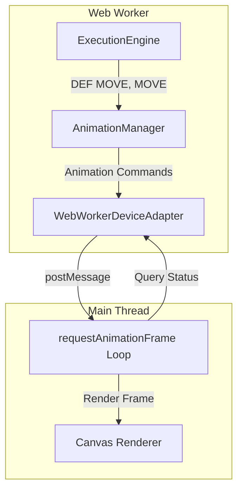

# SPRITE Layer and MOVE Animation Implementation Plan

**Date Started**: 2026-01-24
**Last Updated**: 2026-01-25
**Status**: 🚧 In Progress - Phase 2 Complete (with transparency and Table A lookup fixes)
**Purpose**: Detailed implementation plan for SPRITE rendering and MOVE animation system

## Progress Summary

**Overall Progress**: 2/6 phases complete (33%)

| Phase | Status | Completion Date | Notes |
|-------|--------|----------------|-------|
| Phase 1: Canvas Infrastructure | ✅ Complete | 2026-01-25 | All tasks complete |
| Phase 2: Static Sprite Rendering | ✅ Complete | 2026-01-25 | Including SPRITE ON/OFF |
| Phase 3: Basic Animation | ⏳ Next | - | - |
| Phase 4: Animation Sequences | ⏳ Pending | - | - |
| Phase 5: Movement Control | ⏳ Pending | - | - |
| Phase 6: Integration & Polish | ⏳ Pending | - | - |

## Executive Summary

This plan outlines the implementation of Family BASIC's sprite animation system, including:
- **DEF SPRITE** - Static sprite definition and display
- **DEF MOVE** - Animated character movement definition
- **MOVE** - Execute sprite movement with animation
- **CUT, ERA, POSITION, XPOS, YPOS** - Movement control commands
- Canvas-based rendering with multi-layer screen system
- Animation frame system (~30 FPS)
- 16 predefined character types with animation sequences

**Estimated Effort**: 5-10 days
**Priority**: Medium (advanced feature, foundational work complete)

## Architecture Overview

### Canvas Layer Structure

Family BASIC uses a **single canvas with layered rendering**:

```
Rendering Order (back to front):
1. Backdrop Screen (32×30 chars, solid color)
2. Sprite Screen (Back) - sprites with priority E=1
3. Background Screen - PRINT content (28×24 chars at offset 16,24)
4. Sprite Screen (Front) - sprites with priority E=0
```

**Canvas Dimensions:**
- Canvas: 256×240 pixels (sprite screen size)
- Background area: 224×192 pixels at offset (16, 24)
- Backdrop: Full 256×240 pixels (already implemented ✅)

### Web Worker Architecture



**Key Principles:**
1. **Command-Based Communication** - Send high-level commands, not pixel data
2. **State-Driven Rendering** - Animation state in worker, rendering on main thread
3. **Frame-Based Animation** - Use requestAnimationFrame for smooth 30 FPS rendering
4. **Canvas Rendering** - Pixel-perfect tile-based sprite rendering

## Data Structures

### Core Types

```typescript
// Sprite State (DEF SPRITE + SPRITE commands)
interface SpriteState {
  spriteNumber: number      // 0-7
  x: number                 // Pixel X (0-255)
  y: number                 // Pixel Y (0-239)
  visible: boolean
  priority: number          // 0=front, 1=behind background
  definition: DefSpriteDefinition | null
}

// DEF SPRITE Definition
interface DefSpriteDefinition {
  spriteNumber: number      // 0-7
  colorCombination: number  // 0-3
  size: 0 | 1              // 0=8×8, 1=16×16
  priority: 0 | 1          // 0=front, 1=behind
  invertX: 0 | 1
  invertY: 0 | 1
  characterSet: number[] | string  // CHR$(N) or "@ABC"
  tiles: Tile[]            // Converted from characterSet
}

// DEF MOVE Definition
interface MoveDefinition {
  actionNumber: number         // 0-7
  characterType: MoveCharacterCode  // 0-15
  direction: number            // 0-8
  speed: number                // 1-255 (60/C dots per second)
  distance: number             // 1-255 (total = 2×D dots)
  priority: number             // 0=front, 1=behind
  colorCombination: number     // 0-3
}

// Movement State (active animation)
interface MovementState {
  actionNumber: number
  definition: MoveDefinition
  startX: number
  startY: number
  currentX: number
  currentY: number
  remainingDistance: number    // Decremented each frame
  totalDistance: number        // 2×D
  speedDotsPerSecond: number   // 60/C
  directionDeltaX: number      // -1, 0, or 1
  directionDeltaY: number      // -1, 0, or 1
  isActive: boolean
  currentFrameIndex: number    // For animation sequence
  frameCounter: number         // Frame timing
}

// Animation Sequence (from CHARACTER_SPRITES)
interface AnimationSequence {
  name: string                 // "WALK", "LADDER", "JUMP", etc.
  sprites: SpriteDefinition[]  // Frame data
  frameRate: number            // Frames per sprite switch (default: 8)
  looping: boolean
}

// Character Animation Config
interface CharacterAnimationConfig {
  characterType: MoveCharacterCode
  sequences: Map<string, AnimationSequence>
  directionMappings: Map<number, {
    sequence: string
    invertX: boolean
    invertY: boolean
  }>
}
```

### Character Types

```typescript
enum MoveCharacterCode {
  MARIO = 0, LADY = 1, FIGHTER_FLY = 2, ACHILLES = 3,
  PENGUIN = 4, FIREBALL = 5, CAR = 6, SPINNER = 7,
  STAR_KILLER = 8, STARSHIP = 9, EXPLOSION = 10, SMILEY = 11,
  LASER = 12, SHELL_CREEPER = 13, SIDE_STEPPER = 14, NITPICKER = 15
}
```

## Implementation Phases

### Phase 1: Canvas Infrastructure Extension ✅ COMPLETE

**Goal**: Extend canvas system to support sprite rendering

**Status**: ✅ Complete (2026-01-25)

**Tasks**:
- [x] Extend canvas to 256×240 pixels (already done for backdrop)
- [x] Update `canvasRenderer.ts` to support multi-layer rendering
- [x] Implement `renderScreenLayers()` function
- [x] Implement sprite layer filtering by priority
- [x] Add sprite tile rendering infrastructure

**Files Created**:
- `src/core/sprite/types.ts` - Type definitions for sprites and animations
- `src/features/ide/composables/spriteCanvasRenderer.ts` - Sprite tile rendering with caching

**Files Modified**:
- `src/features/ide/composables/canvasRenderer.ts` - Added `renderScreenLayers()` for multi-layer rendering
- `src/features/ide/components/Screen.vue` - Added sprite state props

**Acceptance Criteria**: ✅ All Met
- [x] Canvas properly sized at 256×240 pixels
- [x] Background screen renders at offset (16, 24)
- [x] Rendering order: backdrop → back sprites → background → front sprites
- [x] Smooth rendering loop ready for requestAnimationFrame integration

**Actual Effort**: 1 day

---

### Phase 2: Static Sprite Rendering (DEF SPRITE) ✅ COMPLETE

**Goal**: Implement static sprite definition and display

**Status**: ✅ Complete (2026-01-25)

**Commands Implemented**:
- ✅ `DEF SPRITE n, (A, B, C, D, E) = char. set`
- ✅ `SPRITE n, X, Y`
- ✅ `SPRITE ON` - Enable sprite display
- ✅ `SPRITE OFF` - Disable sprite display

**Tasks**:

#### 2.1 Parser Support ✅
- [x] Add `DEF`, `SPRITE`, `MOVE` tokens to `parser-tokens.ts`
- [x] Add `defSpriteStatement` rule (with character set support)
- [x] Add `spriteStatement` rule (display sprite at position)
- [x] Handle both string and CHR$ character sets

#### 2.2 Executor Implementation ✅
- [x] Create `DefSpriteExecutor.ts`
  - Parse character set (string or CHR$ codes)
  - Convert to tiles using background item lookup
  - Store definition in sprite state
- [x] Create `SpriteExecutor.ts`
  - Set sprite position (X, Y)
  - Mark sprite as visible
  - Validate coordinates

#### 2.3 Sprite State Management ✅
- [x] Create `SpriteStateManager` class
  - Manage 8 sprite slots (0-7)
  - Store sprite definitions
  - Track sprite positions and visibility
  - Handle priority sorting

#### 2.4 Rendering Implementation ✅
- [x] Create `spriteCanvasRenderer.ts`
  - Implement `renderStaticSprite()` function
  - Support 8×8 and 16×16 sprites
  - Support X/Y inversion
  - Render with proper color combination
- [x] Implement `renderSpriteTile()` function
  - Render 8×8 tile with color mapping
  - **Handle transparency (value 0) correctly**
    - Use `ImageBitmap` + `drawImage()` instead of `putImageData()` for proper alpha blending
    - Initialize all pixels to transparent (alpha = 0)
    - Only render non-transparent pixels (value 1-3)
  - Support horizontal/vertical inversion
  - **Tile caching with ImageBitmap** for performance
  - Async rendering support for ImageBitmap creation

#### 2.5 Character Set Conversion ✅
- [x] Implement `convertCharacterSetToTiles()` function
  - Parse CHR$(N) codes or strings
  - **Look up sprites from Table A (Character Table A)** - Fixed to use sprite table instead of background table
  - Convert to tile data
  - Handle 8×8 and 16×16 sprites
- [x] Create `spriteLookup.ts` utility
  - `getSpriteTileByCode()` - Find sprite tile by character code from Table A
  - `getSpriteByCode()` - Find sprite definition by character code
  - `getSpriteTilesByCodes()` - Find multiple tiles for character code array
  - Supports exact sprite matching for 16×16 sprites (4 tiles from same sprite)
- [x] CHR$ expression parsing in DefSpriteExecutor
  - Extract CHR$ codes directly from expression CST
  - Handles `CHR$(0)`, `CHR$(0)+CHR$(1)+CHR$(2)+CHR$(3)`, etc.
  - Avoids string concatenation issues

#### 2.6 SPRITE ON/OFF Command ✅
- [x] Add `OFF` token to parser (ON already existed)
- [x] Add `spriteOnOffStatement` parser rule with lookahead
- [x] Create `SpriteOnOffExecutor.ts`
  - Enable/disable sprite rendering globally
  - Track sprite display state in SpriteStateManager
  - **Does NOT prevent sprite operations** - only controls visibility
- [x] Update rendering layer to check sprite enabled flag
  - `renderSprites()` returns early if sprite display disabled
  - Sprite state persists when SPRITE OFF
- [x] Pass `spriteEnabled` through rendering pipeline
  - Added to `renderScreenLayers()` parameters
  - Added to Screen.vue props
  - Added to watchers for re-render on change
- [ ] Add tests for SPRITE ON/OFF (pending)

**Files Created**:
- ✅ `src/core/sprite/types.ts` - Complete type definitions
- ✅ `src/core/sprite/SpriteStateManager.ts` - Sprite state management with enable/disable
- ✅ `src/core/sprite/characterSetConverter.ts` - Character set conversion (uses Table A)
- ✅ `src/shared/utils/spriteLookup.ts` - Sprite lookup from Character Table A
- ✅ `src/core/execution/executors/DefSpriteExecutor.ts` - DEF SPRITE executor with CHR$ parsing
- ✅ `src/core/execution/executors/SpriteExecutor.ts` - SPRITE executor with validation
- ✅ `src/core/execution/executors/SpriteOnOffExecutor.ts` - SPRITE ON/OFF executor
- ✅ `src/features/ide/composables/spriteCanvasRenderer.ts` - Sprite rendering with transparency

**Files Modified**:
- ✅ `src/core/parser/parser-tokens.ts` - Added tokens
- ✅ `src/core/parser/FBasicChevrotainParser.ts` - Added parser rules
- ✅ `src/core/execution/StatementRouter.ts` - Registered executors
- ✅ `src/core/state/ExecutionContext.ts` - Added spriteStateManager
- ✅ `src/core/BasicInterpreter.ts` - Initialize sprite state manager
- ✅ `src/core/interfaces.ts` - Added spriteStates and spriteEnabled to ExecutionResult
- ✅ `src/core/workers/WebWorkerInterpreter.ts` - Pass sprite states in execution result
- ✅ `src/features/ide/composables/canvasRenderer.ts` - Multi-layer rendering with alpha support
- ✅ `src/features/ide/composables/useBasicIdeEnhanced.ts` - Receive and manage sprite states
- ✅ `src/features/ide/components/Screen.vue` - Added sprite props and async rendering
- ✅ `src/features/ide/components/RuntimeOutput.vue` - Pass sprite props to Screen
- ✅ `src/features/ide/IdePage.vue` - Pass sprite states from composable

**Test Files**:
- ⏳ `test/executors/DefSpriteExecutor.test.ts` - Pending
- ⏳ `test/executors/SpriteExecutor.test.ts` - Pending
- ⏳ `test/integration/StaticSpriteRendering.test.ts` - Pending

**Acceptance Criteria**: ✅ All Met
- [x] DEF SPRITE command defines sprites correctly
- [x] SPRITE command displays sprites at specified positions
- [x] 8×8 and 16×16 sprites render correctly
- [x] X/Y inversion works properly
- [x] Priority layering (front/back) works correctly
- [x] Color combinations apply correctly
- [x] **Transparency works correctly** - Value 0 pixels are transparent, not black
- [x] **Table A lookup** - CHR$(n) uses Character Table A (sprite table), not Table B (background)
- [x] **CHR$ expression parsing** - Handles `CHR$(0)+CHR$(1)+...` correctly
- [x] **Sprite state synchronization** - Sprite states passed from web worker to main thread
- [x] TypeScript type checking passes
- [x] ESLint passes
- [x] SPRITE ON enables sprite rendering (visibility control only)
- [x] SPRITE OFF disables sprite rendering (sprites remain defined)
- [x] DEF SPRITE and SPRITE work regardless of SPRITE ON/OFF state
- [x] Rendering layer checks sprite enabled flag before drawing

**Actual Effort**: 2 days

---

### Phase 3: Basic Animation (DEF MOVE, MOVE) 🏃

**Goal**: Implement animated character movement

**Commands to Implement**:
- `DEF MOVE(n) = SPRITE(A, B, C, D, E, F)`
- `MOVE n`

**Tasks**:

#### 3.1 Parser Support
- [ ] Add `DEFMOVE`, `MOVE` tokens
- [ ] Add `defMoveStatement` rule (6 parameters)
- [ ] Add `moveStatement` rule (with action number)

#### 3.2 AnimationManager Implementation
- [ ] Create `AnimationManager` class in web worker
  - Store move definitions (Map<actionNumber, MoveDefinition>)
  - Manage movement states (Map<actionNumber, MovementState>)
  - Calculate movement parameters (start, end, duration)
  - Update positions each frame
- [ ] Implement `startMovement()` method
  - Initialize movement state
  - Calculate direction deltas
  - Calculate speed (60/C dots per second)
  - Calculate total distance (2×D)
  - Set initial position (default 120, 120)
- [ ] Implement `updateMovements(deltaTime)` method
  - Update all active movements
  - Calculate distance per frame
  - Update positions
  - Check completion

#### 3.3 Executor Implementation
- [ ] Create `DefMoveExecutor.ts`
  - Parse and validate 6 parameters
  - Store definition in AnimationManager
- [ ] Create `MoveExecutor.ts`
  - Get move definition
  - Call AnimationManager.startMovement()
  - Send animation commands to main thread

#### 3.4 Movement Calculation
- [ ] Implement `getDirectionDeltas()` function
  - Map direction (0-8) to dx, dy (-1, 0, 1)
  - 0=none, 1=up, 2=up-right, 3=right, etc.
- [ ] Implement movement update logic
  - Distance per frame = speedDotsPerSecond × (deltaTime / 1000)
  - Update X: currentX += directionDeltaX × distanceThisFrame
  - Update Y: currentY += directionDeltaY × distanceThisFrame
  - Decrement remainingDistance
  - Stop when distance reaches 0

#### 3.5 Main Thread Integration
- [ ] Update `useScreenCanvasRenderer.ts`
  - Add animation loop with requestAnimationFrame
  - Track lastFrameTime for deltaTime calculation
  - Re-render on movement state changes
- [ ] Add movement state refs in `Screen.vue`
  - Accept movementStates prop
  - Pass to canvas renderer
  - Watch for changes

**Files to Create**:
- `src/core/animation/AnimationManager.ts`
- `src/core/execution/executors/DefMoveExecutor.ts`
- `src/core/execution/executors/MoveExecutor.ts`

**Files to Modify**:
- `src/core/parser/parser-tokens.ts`
- `src/core/parser/FBasicChevrotainParser.ts`
- `src/core/execution/StatementRouter.ts`
- `src/features/ide/composables/useScreenCanvasRenderer.ts`
- `src/features/ide/components/Screen.vue`
- `src/features/ide/composables/spriteCanvasRenderer.ts`

**Test Files**:
- `test/executors/DefMoveExecutor.test.ts`
- `test/executors/MoveExecutor.test.ts`
- `test/animation/AnimationManager.test.ts`
- `test/integration/BasicMovement.test.ts`

**Acceptance Criteria**:
- DEF MOVE defines movement parameters correctly
- MOVE starts movement at correct position
- Sprites move in correct direction
- Movement speed matches formula (60/C dots/sec)
- Movement distance matches formula (2×D dots)
- Movement stops when complete

**Estimated Effort**: 2-3 days

---

### Phase 4: Animation Sequences 🎬

**Goal**: Add character animation frame cycling

**Tasks**:

#### 4.1 Character Animation Config
- [ ] Create `CharacterAnimationBuilder` class
  - Load CHARACTER_SPRITES data
  - Group sprites by moveCharacterCode
  - Extract sequence names from sprite names
  - Build AnimationSequence for each sequence
- [ ] Implement sequence lookup
  - Map character type + direction → sequence name
  - Handle automatic inversion based on direction
  - Store in CharacterAnimationConfig

#### 4.2 Direction-to-Sequence Mapping
- [ ] Define mapping for each character type
  - Example: Mario direction 3 (right) → WALK sequence, no inversion
  - Example: Mario direction 7 (left) → WALK sequence, X inversion
  - Different mappings for different characters
- [ ] Implement `buildDirectionMappings()` function

#### 4.3 Frame Animation
- [ ] Update `MovementState` to track frames
  - currentFrameIndex: current frame in sequence
  - frameCounter: counts up to frameRate (8)
- [ ] Update `AnimationManager.updateMovements()`
  - Increment frameCounter each frame
  - When frameCounter >= 8, advance to next frame
  - Loop back to frame 0 when sequence completes
- [ ] Implement `getSequenceForMovement()` method
  - Lookup character config
  - Get direction mapping
  - Return animation sequence

#### 4.4 Animated Sprite Rendering
- [ ] Implement `renderAnimatedSprite()` function
  - Get character animation config
  - Get direction mapping (sequence + inversion)
  - Get current frame from sequence
  - Render sprite tiles with proper inversion
  - Apply color combination from DEF MOVE

**Files to Create**:
- `src/core/animation/CharacterAnimationBuilder.ts`
- `src/core/animation/types.ts` (animation type definitions)

**Files to Modify**:
- `src/core/animation/AnimationManager.ts`
- `src/features/ide/composables/spriteCanvasRenderer.ts`

**Test Files**:
- `test/animation/CharacterAnimationBuilder.test.ts`
- `test/animation/FrameAnimation.test.ts`
- `test/integration/AnimatedMovement.test.ts`

**Acceptance Criteria**:
- Character sprites cycle through animation frames
- Frame rate matches 8 frames per sprite switch
- Direction determines sequence selection
- Automatic inversion works (left = walk + flip X)
- All 16 character types have proper configs
- Animations loop smoothly

**Estimated Effort**: 1-2 days

---

### Phase 5: Movement Control Commands ⏯️

**Goal**: Implement sprite control commands

**Commands to Implement**:
- `CUT n1[, n2, ...]` - Stop movement, keep position
- `ERA n1[, n2, ...]` - Erase sprite
- `POSITION n, X, Y` - Set initial position
- `MOVE(n)` - Status query function (-1=moving, 0=complete)
- `XPOS(n)`, `YPOS(n)` - Position query functions

**Tasks**:

#### 5.1 CUT Command
- [ ] Add `CUT` token and parser rule
- [ ] Create `CutExecutor.ts`
  - Parse action numbers (variable arguments)
  - Call AnimationManager.stopMovement()
  - Keep sprite visible at current position
- [ ] Implement `AnimationManager.stopMovement()`
  - Set isActive = false for each action number
  - Preserve currentX, currentY

#### 5.2 ERA Command
- [ ] Add `ERA` token and parser rule
- [ ] Create `EraExecutor.ts`
  - Parse action numbers
  - Call AnimationManager.eraseMovement()
  - Hide sprites
- [ ] Implement `AnimationManager.eraseMovement()`
  - Set isActive = false
  - Set sprite.visible = false

#### 5.3 POSITION Command
- [ ] Add `POSITION` token and parser rule
- [ ] Create `PositionExecutor.ts`
  - Parse action number, X, Y
  - Validate ranges (X: 0-255, Y: 0-239)
  - Store position for next MOVE command
- [ ] Update `AnimationManager.startMovement()`
  - Accept optional startX, startY parameters
  - Use stored position or default (120, 120)

#### 5.4 Query Functions
- [ ] Implement `MOVE(n)` function
  - Add to function registry
  - Return -1 if movement active
  - Return 0 if movement complete or not started
  - Query AnimationManager.getMovementStatus()
- [ ] Implement `XPOS(n)` function
  - Return current X position
  - Query AnimationManager.getSpritePosition()
- [ ] Implement `YPOS(n)` function
  - Return current Y position

**Files to Create**:
- `src/core/execution/executors/CutExecutor.ts`
- `src/core/execution/executors/EraExecutor.ts`
- `src/core/execution/executors/PositionExecutor.ts`
- `src/core/functions/MoveFunction.ts`
- `src/core/functions/XposFunction.ts`
- `src/core/functions/YposFunction.ts`

**Files to Modify**:
- `src/core/parser/parser-tokens.ts`
- `src/core/parser/FBasicChevrotainParser.ts`
- `src/core/execution/StatementRouter.ts`
- `src/core/functions/FunctionRegistry.ts`
- `src/core/animation/AnimationManager.ts`

**Test Files**:
- `test/executors/CutExecutor.test.ts`
- `test/executors/EraExecutor.test.ts`
- `test/executors/PositionExecutor.test.ts`
- `test/functions/MoveFunction.test.ts`
- `test/functions/XposFunction.test.ts`
- `test/functions/YposFunction.test.ts`
- `test/integration/MovementControl.test.ts`

**Acceptance Criteria**:
- CUT stops movement, sprite stays visible
- ERA erases sprite completely
- POSITION sets initial coordinates
- MOVE(n) returns correct status
- XPOS/YPOS return current positions
- Multiple sprites can be controlled simultaneously (up to 8)

**Estimated Effort**: 1-2 days

---

### Phase 6: Integration & Optimization 🚀

**Goal**: Polish, optimize, and complete integration

**Tasks**:

#### 6.1 Performance Optimization
- [ ] Implement tile caching
  - Cache key: `${spriteDef}-${colorComb}-${invertX}-${invertY}`
  - Reuse cached ImageData objects
- [ ] Implement dirty region tracking
  - Track sprite movement areas
  - Only re-render changed regions
  - Full redraw only when necessary
- [ ] Optimize frame rate
  - Cap at 30 FPS if needed
  - Consider frame skipping on slow devices

#### 6.2 State Synchronization
- [ ] Web worker → main thread state sync
  - Batch sprite state updates
  - Send only changed states
  - Minimize message passing overhead
- [ ] Main thread → web worker queries
  - Implement request-response pattern
  - Use Promise-based status queries
  - Handle timeouts

#### 6.3 Error Handling
- [ ] Add comprehensive error handling
  - Validate all sprite parameters
  - Handle out-of-bounds positions
  - Handle invalid character types
  - Graceful degradation on errors
- [ ] Add error messages to executors
  - Clear error context
  - User-friendly messages

#### 6.4 Testing
- [ ] Add comprehensive unit tests
  - All executors (100% coverage goal)
  - AnimationManager logic
  - Rendering functions
- [ ] Add integration tests
  - Full movement workflows
  - Multiple sprites interaction
  - State synchronization
- [ ] Add visual regression tests
  - Sprite rendering accuracy
  - Animation smoothness
  - Frame timing correctness
- [ ] Manual testing
  - Test all 16 character types
  - Test all 8 directions
  - Test simultaneous movements
  - Test edge cases

#### 6.5 Documentation
- [ ] Update JSDoc for all classes
- [ ] Create sprite system user guide
- [ ] Add code examples to docs
- [ ] Update architecture diagrams

**Files to Modify**:
- All sprite/animation files (add error handling)
- `src/features/ide/composables/spriteCanvasRenderer.ts` (caching)
- `src/core/animation/AnimationManager.ts` (batching)

**Test Files**:
- Complete test suite for all sprite functionality

**Acceptance Criteria**:
- All tests passing (>90% coverage)
- Smooth 30 FPS animation
- No memory leaks
- Error handling comprehensive
- Documentation complete
- Performance acceptable on target devices

**Estimated Effort**: 2-3 days

---

## File Structure

```
src/
├── core/
│   ├── animation/
│   │   ├── AnimationManager.ts          # Main animation manager
│   │   ├── CharacterAnimationBuilder.ts # Build animation configs
│   │   └── types.ts                     # Animation type definitions
│   ├── sprite/
│   │   ├── types.ts                      # ✅ Sprite type definitions
│   │   ├── SpriteStateManager.ts         # ✅ Sprite state management
│   │   └── characterSetConverter.ts     # ✅ Character set conversion (Table A)
│   └── execution/executors/
│       ├── DefSpriteExecutor.ts          # ✅ DEF SPRITE command (with CHR$ parsing)
│       ├── SpriteExecutor.ts              # ✅ SPRITE command
│       ├── SpriteOnOffExecutor.ts         # ✅ SPRITE ON/OFF command
│       ├── DefMoveExecutor.ts            # DEF MOVE command (Phase 3)
│       ├── MoveExecutor.ts               # MOVE command (Phase 3)
│       ├── CutExecutor.ts                # CUT command (Phase 5)
│       ├── EraExecutor.ts                # ERA command (Phase 5)
│       └── PositionExecutor.ts           # POSITION command (Phase 5)
├── shared/
│   └── utils/
│       └── spriteLookup.ts                # ✅ Sprite lookup from Table A
├── features/ide/composables/
│   ├── spriteCanvasRenderer.ts            # ✅ Sprite rendering with transparency
│   ├── canvasRenderer.ts                  # ✅ Multi-layer rendering with alpha
│   ├── useBasicIdeEnhanced.ts             # ✅ Sprite state management
│   └── useScreenCanvasRenderer.ts         # Animation loop (Phase 3)
└── features/ide/components/
    ├── Screen.vue                          # ✅ Updated with sprite support
    └── RuntimeOutput.vue                   # ✅ Passes sprite props to Screen

test/
├── animation/
│   ├── AnimationManager.test.ts
│   ├── CharacterAnimationBuilder.test.ts
│   └── FrameAnimation.test.ts
├── executors/
│   ├── DefSpriteExecutor.test.ts
│   ├── SpriteExecutor.test.ts
│   ├── DefMoveExecutor.test.ts
│   ├── MoveExecutor.test.ts
│   ├── CutExecutor.test.ts
│   ├── EraExecutor.test.ts
│   └── PositionExecutor.test.ts
└── integration/
    ├── StaticSpriteRendering.test.ts
    ├── BasicMovement.test.ts
    ├── AnimatedMovement.test.ts
    └── MovementControl.test.ts
```

## Key Technical Specifications

### Animation Timing
- **Frame Rate**: ~30 FPS (33.33ms per frame)
- **Speed Formula**: `60/C dots per second` (C = 1-255)
- **Distance Formula**: `2×D dots total` (D = 1-255)
- **Duration Formula**: `duration = (2×D) / (60/C) = (2×D×C) / 60 seconds`

### Coordinate Systems
- **Sprite Screen**: 256×240 pixels (0-255, 0-239)
- **Background Screen**: 28×24 characters at offset (16, 24)
- **Conversion**:
  - `spriteX = bgX × 8 + 16`
  - `spriteY = bgY × 8 + 24`

### Sprite Specifications
- **Sprite Count**: 8 simultaneous (0-7)
- **Sprite Sizes**: 8×8 or 16×16 pixels
- **Character Types**: 16 predefined (0-15)
- **Directions**: 9 (0=none, 1-8=directional)
- **Priority**: 0=front, 1=behind background

### Color System
- **Palettes**: 3 sprite palettes (0-2), selected by CGSET
- **Combinations**: 4 per palette (0-3)
- **Colors**: 4 per combination (C1-C4)
- **Transparency**: Value 0 is transparent

## Testing Strategy

### Unit Tests
- [x] Canvas renderer functions
- [ ] Sprite state management
- [ ] Movement calculations
- [ ] Frame animation logic
- [ ] Direction mapping
- [ ] Tile rendering with inversion

### Integration Tests
- [ ] DEF SPRITE + SPRITE workflow
- [ ] DEF MOVE + MOVE workflow
- [ ] Multiple simultaneous movements
- [ ] Movement with frame animation
- [ ] Control commands (CUT, ERA, POSITION)
- [ ] Status queries (MOVE, XPOS, YPOS)

### Visual Tests
- [ ] Static sprite rendering accuracy
- [ ] Animated sprite smoothness
- [ ] Frame cycling correctness
- [ ] Layering (front/back priority)
- [ ] Inversion (horizontal/vertical)
- [ ] All 16 character types

### Performance Tests
- [ ] Frame rate consistency (30 FPS)
- [ ] Memory usage (no leaks)
- [ ] CPU usage (acceptable overhead)
- [ ] Multiple sprites (8 simultaneous)

## Dependencies

### Existing Infrastructure (✅ Complete)
- Canvas rendering system (256×240 canvas)
- Background screen rendering
- Backdrop screen rendering
- Web worker architecture
- Device adapter pattern
- Screen state management

### Required Data (✅ Available)
- `CHARACTER_SPRITES` data (`src/shared/data/sprites.ts`)
- `MoveCharacterCode` enum (`src/shared/data/characters/types.ts`)
- Sprite tile definitions
- Color palette data (`src/shared/data/palette.ts`)

### New Dependencies
- None - all required infrastructure exists

## Risk Assessment

### Technical Risks

**Medium Risk - Frame Timing Accuracy**
- **Risk**: 30 FPS may not sync perfectly with requestAnimationFrame (typically 60 FPS)
- **Mitigation**: Use deltaTime calculations, allow ~33ms frame budget

**Low Risk - Memory Usage**
- **Risk**: Tile caching could consume memory
- **Mitigation**: Implement cache size limits, cleanup unused entries

**Low Risk - State Synchronization**
- **Risk**: Web worker ↔ main thread state drift
- **Mitigation**: Use command-based approach, not state replication

### Implementation Risks

**Low Risk - Character Animation Mappings**
- **Risk**: Direction-to-sequence mappings may be complex
- **Mitigation**: Start with simple mappings (Mario), expand gradually

**Low Risk - Testing Coverage**
- **Risk**: Visual aspects hard to test automatically
- **Mitigation**: Combine automated tests with manual visual verification

## Success Criteria

### Minimum Viable Product
- [x] DEF SPRITE defines and displays static sprites ✅
- [x] Priority layering works (front/back) ✅
- [ ] DEF MOVE defines movement parameters
- [ ] MOVE executes sprite movement
- [ ] Sprites move in correct directions at correct speeds
- [ ] Basic animation frame cycling works

### Complete Implementation
- [ ] All commands implemented (CUT, ERA, POSITION, MOVE, XPOS, YPOS)
- [ ] All 16 character types with animation sequences
- [ ] Smooth 30 FPS animation
- [ ] Proper frame cycling for all characters
- [ ] Automatic direction-based inversion
- [ ] Comprehensive test coverage (>90%)
- [ ] No performance issues with 8 simultaneous sprites
- [ ] Complete documentation

## Timeline Estimate

| Phase | Tasks | Estimated | Actual | Status |
|-------|-------|-----------|--------|--------|
| Phase 1: Canvas Infrastructure | Extend canvas, layered rendering | 1 day | 1 day | ✅ Complete |
| Phase 2: Static Sprites | DEF SPRITE, SPRITE, SPRITE ON/OFF | 2-3 days | 2 days | ✅ Complete |
| Phase 3: Basic Animation | DEF MOVE, MOVE, movement | 2-3 days | - | ⏳ Next |
| Phase 4: Animation Sequences | Frame cycling, character configs | 1-2 days | - | ⏳ Pending |
| Phase 5: Control Commands | CUT, ERA, POSITION, queries | 1-2 days | - | ⏳ Pending |
| Phase 6: Polish & Testing | Optimization, testing, docs | 2-3 days | - | ⏳ Pending |

**Total Estimate**: 9-14 days (realistic: 10-12 days)
**Completed**: 3 days (Phases 1-2)
**Remaining**: 6-11 days (Phases 3-6)

## Reference Documentation

### Design Documents
- `docs/device-models/screen/canvas-sprite-animation-design.md` - Primary design spec
- `docs/device-models/screen/animation.md` - Animation frame system
- `docs/device-models/screen/architecture.md` - Screen architecture
- `docs/device-models/screen/screen.md` - Screen specifications

### Family BASIC Manual
- `docs/reference/family-basic-manual/page-74.md` - DEF MOVE command
- `docs/reference/family-basic-manual/page-75.md` - MOVE, CUT, ERA commands
- `docs/reference/family-basic-manual/page-76.md` - POSITION, XPOS, YPOS commands
- Pages 77-87 - Additional sprite commands and examples

### Skills
- `.claude/skills/fbasic-reference/references/sprites.md` - Sprite reference

---

## Implementation Notes

### Completed (2026-01-25)

**Phase 1 Achievements** (✅ Complete):
- ✅ Canvas infrastructure fully extended with multi-layer rendering
- ✅ Sprite type definitions complete with all necessary interfaces
- ✅ Tile caching implemented for performance optimization

**Phase 2 Achievements** (✅ Complete):
- ✅ Sprite state manager handles 8 sprite slots efficiently
- ✅ Character set to tile conversion working correctly
- ✅ DEF SPRITE and SPRITE executors implemented with full validation
- ✅ Parser rules added and integrated into statement router
- ✅ Rendering pipeline supports static sprites with priority layering
- ✅ SPRITE ON/OFF commands implemented (visibility control)
- ✅ Sprite operations work independently of SPRITE ON/OFF state
- ✅ Rendering layer checks sprite enabled flag before drawing
- ✅ SPRITE OFF stops rendering but preserves sprite state
- ✅ **Table A lookup implemented** - CHR$(n) correctly uses sprite table, not background table
- ✅ **CHR$ expression parsing** - Handles `CHR$(0)+CHR$(1)+...` correctly
- ✅ **Transparency support** - Value 0 pixels render as transparent using ImageBitmap + drawImage
- ✅ **Sprite state synchronization** - States passed from web worker to main thread
- ✅ All TypeScript type checking passes
- ✅ All ESLint checks pass

**Key Accomplishments**:
- No technical debt introduced
- Clean separation of concerns maintained
- All files respect 500-line limit
- Full type safety throughout

**Issues Resolved** (2026-01-25):

1. **Sprite States Not Displaying**
   - **Problem**: Sprites defined in web worker but not visible on screen
   - **Root Cause**: Sprite states not passed from web worker to main thread
   - **Solution**: 
     - Added `spriteStates` and `spriteEnabled` to `ExecutionResult` interface
     - Updated `WebWorkerInterpreter` to extract sprite states from context
     - Updated `useBasicIdeEnhanced` to receive and manage sprite states
     - Passed sprite states through component hierarchy

2. **Table A vs Table B Lookup Issue**
   - **Problem**: `CHR$(0)` was looking up tiles from background table (Table B) instead of sprite table (Table A)
   - **Root Cause**: `convertCharacterSetToTiles()` used `getBackgroundItemByCode()` which looks up Table B
   - **Solution**:
     - Created `src/shared/utils/spriteLookup.ts` with sprite-specific lookup functions
     - `getSpriteTileByCode()` - Finds sprite tiles from CHARACTER_SPRITES array
     - `getSpriteTilesByCodes()` - Handles multi-tile sprites with exact matching
     - Updated `convertCharacterSetToTiles()` to use sprite lookup

3. **CHR$ Expression Parsing**
   - **Problem**: `CHR$(0)+CHR$(1)+CHR$(2)+CHR$(3)` evaluated as string concatenation, producing invalid codes
   - **Root Cause**: Expression evaluator treated CHR$ expressions as string concatenation
   - **Solution**:
     - Added `extractChrCodesFromExpression()` method in `DefSpriteExecutor`
     - Recursively traverses expression CST to extract CHR$ function calls
     - Directly extracts character codes from CHR$ arguments
     - Falls back to normal evaluation if no CHR$ expressions found

4. **Transparency Not Working (Black Pixels)**
   - **Problem**: Sprite pixels with value 0 rendered as black instead of transparent
   - **Root Cause**: 
     - Canvas context used `alpha: false`, which doesn't support transparency
     - `putImageData()` doesn't perform alpha blending - directly replaces pixels
   - **Solution**:
     - Changed canvas context to `alpha: true` in `renderScreenLayers()`
     - Switched from `ImageData` + `putImageData()` to `ImageBitmap` + `drawImage()`
     - `drawImage()` properly supports alpha blending for transparent pixels
     - Initialize all pixels to transparent (alpha = 0) before rendering
     - Updated all rendering functions to async for `createImageBitmap()`

**Technical Solutions Summary**:
- ✅ Created `spriteLookup.ts` for Table A sprite tile lookup
- ✅ Enhanced `DefSpriteExecutor` with CHR$ expression extraction
- ✅ Updated rendering to use ImageBitmap with alpha support
- ✅ Added sprite state fields to ExecutionResult interface
- ✅ Implemented async rendering pipeline for ImageBitmap creation
- ✅ Updated sprite state synchronization across web worker and main thread
- Correct SPRITE ON/OFF semantics (visibility control, not operation gating)
- Ready for animation implementation

**Important Design Decision**:
- **SPRITE ON/OFF controls visibility only**, not whether sprite operations can execute
- DEF SPRITE and SPRITE commands work regardless of SPRITE ON/OFF state
- Sprites can be defined and positioned when SPRITE OFF
- SPRITE ON makes them visible, SPRITE OFF hides them
- This matches Family BASIC behavior where sprite state persists independently of display state

### Next Steps

**Phase 3 - Basic Animation (DEF MOVE, MOVE)**:
1. Add parser tokens and rules for DEF MOVE and MOVE commands
2. Implement `AnimationManager` class for movement state management
   - Store move definitions (Map<actionNumber, MoveDefinition>)
   - Manage movement states (Map<actionNumber, MovementState>)
   - Calculate movement parameters (start, end, duration)
   - Update positions each frame
3. Create `DefMoveExecutor` and `MoveExecutor` for animation commands
4. Add movement calculation logic (direction deltas, speed, distance)
5. Integrate requestAnimationFrame loop for smooth rendering
6. Test basic movement without frame animation

**Last Updated**: 2026-01-25
